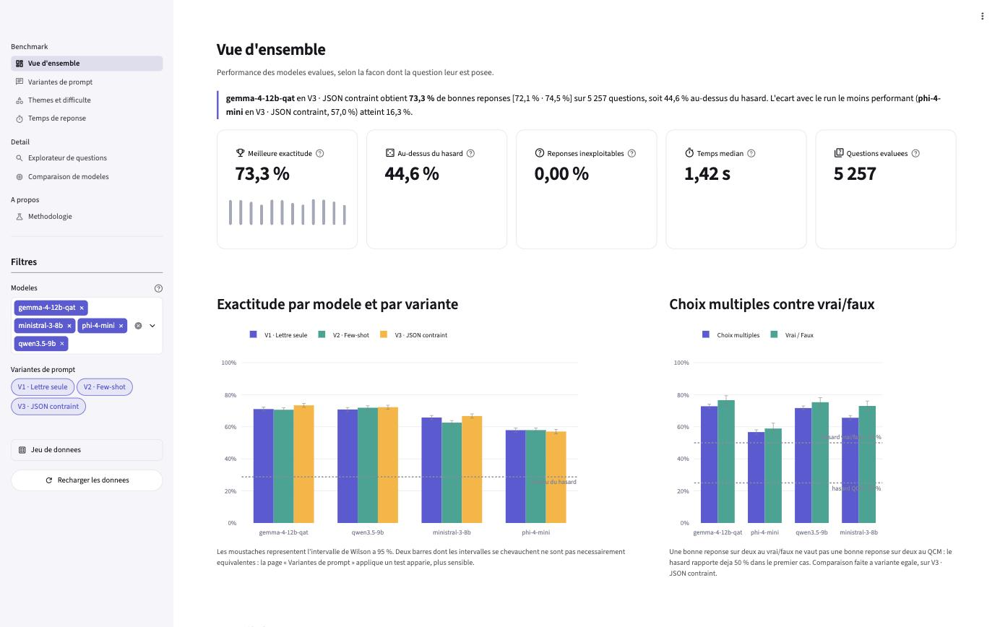
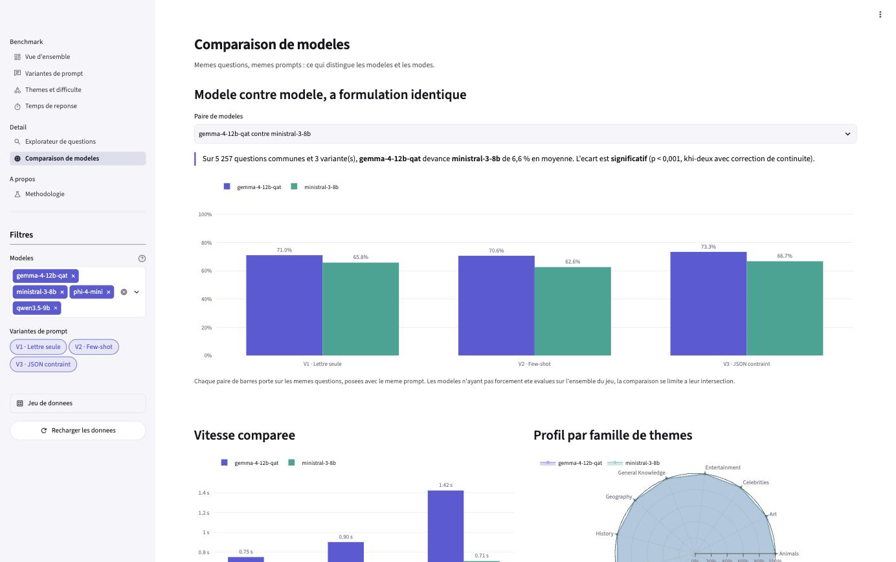

# trivia-bench

Benchmark d'un modèle de langage exécuté localement sur les 5 261 questions de culture générale
d'[Open Trivia Database](https://opentdb.com), avec un pipeline de données complet en
architecture médaillon et un rapport interactif.

[](https://github.com/RaptorZ99/trivia-bench/actions/workflows/ci.yml)


> Projet M2 DEV — EFREI. La spécification technique complète se trouve dans [`SPEC.md`](SPEC.md),
> et les rapports de documentation qui l'ont fondée dans [`docs/research/`](docs/research/).

---

## Ce que mesure ce benchmark

La même question de culture générale est posée de **trois façons différentes** à **quatre modèles
exécutés localement**, un par éditeur. On mesure ce que chaque formulation change — taux de
bonnes réponses, respect du format de sortie, temps de réponse — et ce qui distingue les modèles
à formulation égale.

| Modèle | Éditeur | Paramètres | Taille |
|---|---|---|---|
| `google/gemma-4-12b-qat` | Google | 12 B | 7,15 Go |
| `qwen/qwen3.5-9b` | Alibaba | 9 B | 6,55 Go |
| `mistralai/ministral-3-8b` | Mistral | 8 B | 6,06 Go |
| `microsoft/phi-4-mini` | Microsoft | 3,8 B | 2,49 Go |

Les quatre sont chargés dans la même configuration, servis par le même moteur d'inférence et
interrogés selon la même règle : les écarts observés viennent des modèles, pas du montage.

<!-- RESULTATS -->

**63 084 réponses** : quatre modèles × trois formulations × 5 257 questions, aucune erreur d'appel,
aucune réponse perdue.

| Modèle | Meilleure exactitude | IC 95 % | Au-dessus du hasard | Temps médian |
|---|---|---|---|---|
| Gemma 4 12B QAT | **73,3 %** | [72,1 ; 74,5] | +44,6 pt | 1,42 s |
| Qwen 3.5 9B | 72,2 % | [71,0 ; 73,4] | +43,5 pt | 1,11 s |
| Ministral 3 8B | 66,7 % | [65,4 ; 68,0] | +38,0 pt | 0,71 s |
| Phi-4-mini 3,8B | 57,9 % | [56,6 ; 59,3] | +29,2 pt | 0,14 s |

L'exactitude suit la taille sans exception, mais le prix du dernier point est élevé : Phi-4-mini
répond **dix fois plus vite** que Gemma et tient dans trois fois moins de mémoire, pour 15 points
d'exactitude en moins.

---

## Architecture

```
OpenTDB ──scrape──▶  bronze : questions_raw.csv, réponses HTTP brutes
                        │
                     clean │  nettoyage, identifiants, ordre des options figé
                        ▼
LM Studio ──bench──▶  bronze : une ligne JSON par appel au modèle
                        │
                     grade │  notation déterministe en Python
                        ▼
                     silver : questions.parquet, answers/run_id=*/, runs.parquet
                        │
                      dbt   │  vues staging puis tables gold
                        ▼
                     gold : benchmark.duckdb  ──▶  dashboard Streamlit
```

| Couche | Format | Contenu | Rôle |
|---|---|---|---|
| **Bronze** | CSV, JSONL | Questions brutes de l'API, réponses HTTP, réponses du modèle telles quelles, manifestes de run | Conserver la donnée sans interprétation : on peut toujours revenir à la réponse exacte du modèle, mot pour mot |
| **Silver** | Parquet (zstd) | Questions nettoyées et typées, réponses notées partitionnées par run | Observations propres et exploitables, notation figée |
| **Gold** | DuckDB | 17 tables métier + 3 vues de préparation, construites par dbt | Répondre directement à une question métier, sans jointure supplémentaire |

Les réponses sont **partitionnées par run** (`data/silver/answers/run_id=…/part-0.parquet`) :
chaque run écrit un fichier immuable plutôt que de réécrire un fichier commun, ce qui rend la
reprise sûre et la lecture unifiée par glob.

### Organisation du dépôt

```
src/trivia_bench/     # package Python : scrape, clean, bench, build
  ├── scrape/         # client OpenTDB, checkpoint, boucle de collecte
  ├── clean/          # normalisation, mélange déterministe, construction silver
  ├── bench/          # client LM Studio, prompts, notation, runner, manifeste
  ├── build/          # invocation dbt
  └── prompts/        # gabarits de prompt versionnés (fichiers texte)
dbt/                  # projet dbt : sources, staging, marts, macros, tests
app/                  # dashboard Streamlit (lib/ + views/)
tests/                # 198 tests : unitaires, intégration, build dbt, rendu du dashboard
data/                 # bronze / silver / gold, versionnés dans le dépôt
docs/research/        # rapports de documentation ayant fondé la spécification
```

---

## Méthodologie

### 1. Collecte des questions

L'API OpenTDB ne sert que les questions **vérifiées** (5 298 au 2026-09-10 sur 21 617 en base)
et impose une limite d'**un appel toutes les 5 secondes par adresse IP**. Trois précautions
structurent le scraper :

- **Un token de session** pour toute la collecte : il garantit qu'une même question n'est pas
  servie deux fois. Sans lui, les tirages sont aléatoires et se recoupent.
- **Un dimensionnement exact des lots** via `api_count.php` : demander plus de questions qu'il
  n'en reste renvoie un tableau **vide**, pas un résultat partiel. On calcule donc la taille de
  chaque lot avant de le demander.
- **Un checkpoint par catégorie**, écrit après chaque lot : la collecte reprend exactement où
  elle s'est arrêtée.

Le transport utilise `encode=base64`, ce qui évite tout problème d'entités HTML mal décodées.
Le statut HTTP n'est jamais interprété seul : l'API renvoie 200 même sur une erreur
applicative, c'est le champ `response_code` qui fait foi.

**Résultat** : 5 261 questions uniques collectées en 142 appels, réparties sur 24 catégories
(4 478 à choix multiples, 783 vrai/faux).

### 2. Préparation

- **Identifiant déterministe** : OpenTDB ne fournit aucun identifiant. On dérive un `question_id`
  du contenu normalisé (`sha256` de catégorie, type, difficulté, question, bonne réponse). Il est
  stable entre exécutions et entre machines, ce qui permet la déduplication et la reprise.
- **Ordre des options figé** : les options sont mélangées une fois pour toutes avec une graine
  dérivée de l'identifiant. Toutes les variantes et tous les modèles voient donc exactement la
  même présentation, et la bonne réponse n'est pas systématiquement en première position. Le
  biais de position des modèles en questions à choix multiples est documenté ; il reste mesurable
  dans la table `mart_position_bias`.
- **Exemples few-shot réservés** : quatre questions servent d'exemples dans la variante V2 et
  sont exclues de l'évaluation.

### 3. Les trois variantes de prompt

Les gabarits sont des fichiers texte versionnés dans `src/trivia_bench/prompts/`, et l'empreinte
du prompt effectivement envoyé est enregistrée avec chaque réponse.

| Variante | Ce qu'elle isole | Sortie attendue |
|---|---|---|
| **V1 · Lettre seule** | Conformité de format sur instruction nue, avec options | `B` |
| **V2 · Few-shot** | Démonstration du format par deux exemples résolus | `B` |
| **V3 · JSON contraint** | Format garanti par le décodage lui-même | `{"answer": "B"}` |

Chaque variante existe en version choix multiples et en version vrai/faux. Les trois attendent une
**réponse courte** : une lettre en choix multiples, le mot lui-même en vrai/faux.

Une quatrième formulation, écartée, mérite d'être mentionnée : celle du harnais OpenAI
*simple-evals*, qui impose `Answer: $LETTER` en dernière ligne. Le modèle y délibère en prose sur
33 tokens de médiane malgré un prompt système lui demandant de ne jamais expliquer, et **10,5 % des
réponses sont coupées par le budget de tokens avant d'atteindre la lettre**. Son score mesurerait
le budget accordé plutôt que la formulation, ce qui la rendrait incomparable aux trois autres.

### 4. Conditions d'exécution

- **Décodage glouton** : `temperature=0`, `top_k=1`, `top_p=1`, `min_p=0`, `repeat_penalty=1`.
  Un benchmark cherche la réponse la plus probable du modèle, pas de la diversité. Trois appels
  identiques donnent la même réponse, ce que `trivia check` vérifie avant chaque campagne.
- **Une requête à la fois** : le modèle est chargé avec un seul emplacement de prédiction
  (`--parallel 1`). Le traitement par lots du serveur ferait se recouvrir plusieurs générations
  et fausserait le temps mesuré pour chaque question.
- **Appel de chauffe** : le premier appel de chaque run paie la mise en cache du prompt système.
  Il est effectué sur une question hors jeu et exclu des mesures.
- **Raisonnement désactivé** : voir la section suivante.

### 5. Pourquoi l'API REST de LM Studio et non le SDK Python

La consigne suggère d'utiliser l'API Python de LM Studio. Le SDK `lmstudio` (1.5.0, dernière
version publiée) **ne permet pas de désactiver le mode « thinking »**, actif par défaut sur deux
des quatre modèles évalués. Sur une question triviale, le modèle consomme alors tout son budget de
tokens en raisonnement et **ne répond pas** ; le SDK renvoie de surcroît le raisonnement mélangé
au texte de réponse, suivi d'un marqueur interne.

Le projet utilise donc l'**API REST officielle de LM Studio**, pilotée depuis Python avec
`httpx`. Elle expose trois endpoints de complétion, et un seul réunit tout ce que le benchmark
exige d'un même appel :

| Endpoint | Raisonnement désactivable | Sortie contrainte | Statistiques moteur |
|---|---|---|---|
| SDK Python `lmstudio` | Non | Oui | Oui |
| `/api/v1/chat` | Oui (`reasoning: "off"`) | Non (HTTP 400) | Oui |
| `/v1/chat/completions` | Oui (`reasoning_effort: "none"`) | Oui (`json_schema`) | Non |
| **`/api/v0/chat/completions`** | **Oui** (`reasoning_effort: "none"`) | **Oui** (`json_schema`) | **Oui** (TTFT, tokens/s) |

**L'endpoint découle de ce que la variante exige**, et la règle vaut à l'identique pour les quatre
modèles. Les variantes en texte court utilisent l'endpoint natif, qui rejette les clés inconnues
et protège donc contre une faute de frappe dans un paramètre de décodage. La variante à sortie
contrainte ne peut pas y rester — il refuse `response_format` — et passe par
`/api/v0/chat/completions`, seul des deux endpoints compatibles à renvoyer aussi les statistiques
moteur. Toutes les variantes portent ainsi les mêmes colonnes, et deux modèles se comparent
toujours à endpoint égal.

Comparer deux variantes traverse en revanche deux endpoints. Leur équivalence a été mesurée sur
40 questions appariées, en alternant l'ordre des appels pour qu'aucun ne profite systématiquement
du cache de prompt : **réponses identiques 40 fois sur 40**, temps au premier token de 0,139 s
contre 0,138 s, débit de 21,4 tokens par seconde de part et d'autre.

Le format servi et la longueur de contexte effectivement appliquée sont relevés sur l'instance
elle-même et consignés dans le manifeste de chaque run : ce sont eux qui garantissent que les
quatre modèles tournent bien sur le même moteur, dans la même configuration.

### 6. Notation des réponses

Deux colonnes sortent de la notation :

- **`ai_correct`** (booléen) : la réponse correspond à la bonne réponse, quelle que soit sa forme.
- **`grade`** : *comment* la correspondance a été établie, ce qui sépare deux échecs de nature
  différente.

Le format attendu dépend du type de question : **une lettre** en choix multiples, **le mot
lui-même** en vrai/faux. Les deux premières notations correspondent donc au format demandé,
chacune pour son type.

| Notation | Signification |
|---|---|
| `letter` | Le modèle a répondu par la lettre attendue (format demandé en choix multiples) |
| `exact` | Il a écrit la réponse en toutes lettres (format demandé en vrai/faux) |
| `fuzzy` | Similarité ≥ 90 avec l'option, et écart ≥ 5 points avec la deuxième meilleure |
| `contains` | La bonne réponse figure dans une phrase, sans négation devant |
| `wrong` | Une réponse a été identifiée, mais elle est incorrecte |
| `unparseable` | Aucune réponse identifiable : échec de **format**, pas de connaissance |
| `error` | L'appel au modèle a échoué après plusieurs tentatives |

**Budget de tokens et troncature.** Chaque variante fixe une longueur maximale de réponse,
enregistrée avec chaque appel : huit tokens pour les deux variantes en texte court — quatre fois
ce qu'une réponse conforme demande — et vingt-quatre pour la variante JSON. **2,37 % des réponses
atteignent cette limite** : 1,25 % en V1, 5,87 % en V2, et aucune en V3, le schéma bornant la
longueur par construction.

Ces troncatures suivent deux profils, que la notation ne traite pas de la même façon :

| Profil | Exemple reçu | Effet sur la notation |
|---|---|---|
| Le modèle répond **puis commente** | `B  *(Note: As of my` | La lettre attendue est émise en premier et reste lisible : la troncature ne coupe que le commentaire. **854 des 1 496 réponses tronquées sont créditées.** Ministral en V2 est le plus concerné (1 094 réponses, 20,8 % de son run), devant Phi-4-mini en V1 (207). |
| Le modèle **refuse de choisir** | `None of the options provided are correct.` | Aucune lettre n'est émise, la réponse est inexploitable. Les 54 réponses tronquées de Gemma en V1 sont toutes de ce type. |

La troncature n'est donc pas en soi un échec de format : elle signale surtout un modèle qui
ajoute une justification non demandée après une réponse correcte. Elle sert malgré tout de
garde-fou à la notation — le rapprochement par sous-chaîne y est refusé, faute de pouvoir lire la
suite qui contredirait le texte reçu. Elle se déduit de la comparaison entre tokens générés et
budget demandé, plus fiable qu'un `finish_reason` dont la valeur dépend du moteur, et la colonne
`is_truncated` de la couche gold permet de vérifier l'ensemble à tout moment.

La normalisation décode les entités HTML, retire les accents, la ponctuation (donc aussi la mise
en forme Markdown que le modèle produit spontanément) et les articles. Une garde anti-négation
évite de créditer une bonne réponse citée pour être réfutée (« ce n'est pas Mercure, mais Vénus »).

La notation est calculée **une seule fois, en Python**, jamais en SQL : le rapprochement approché
n'a pas d'équivalent SQL identique, et une implémentation unique évite que deux logiques
divergent. La commande `trivia grade` peut renoter tous les runs sans réinterroger le modèle.

### 7. Statistiques

- **Intervalle de Wilson** plutôt que l'approximation normale, pour toute proportion : il reste
  valide quand l'effectif est faible ou la proportion proche de 0 ou 1, ce qui arrive dans les
  petites catégories.
- **Test de McNemar** pour comparer deux variantes : elles répondent aux mêmes questions, la
  comparaison est appariée et seules les paires discordantes portent de l'information. En dessous
  de 25 paires discordantes, le test binomial exact remplace l'approximation du khi-deux.
- **Bootstrap apparié** pour l'intervalle de confiance de l'écart entre deux variantes.
- **Niveau du hasard** : 25 % en choix multiples, 50 % en vrai/faux. Une exactitude brute de 55 %
  en vrai/faux vaut moins qu'une exactitude de 45 % en choix multiples ; le dashboard affiche donc
  systématiquement l'écart au hasard.
- **Effectif faible** : en dessous de 30 questions, la catégorie est signalée plutôt que masquée.

---

## Installation

### Prérequis

| | |
|---|---|
| Machine | macOS Apple Silicon, 16 Go de mémoire recommandés |
| Python | 3.12 (installé automatiquement par `uv`) |
| [`uv`](https://docs.astral.sh/uv/) | `curl -LsSf https://astral.sh/uv/install.sh \| sh` |
| [LM Studio](https://lmstudio.ai) | ≥ 0.4.24, lancé au moins une fois |
| Réseau | Accès à `opentdb.com` pour la collecte uniquement |

### Mise en place

```bash
git clone <url-du-depot> && cd trivia-bench
uv sync                       # crée .venv et installe tout
uv run pre-commit install     # optionnel : hooks de qualité
cp .env.example .env          # puis renseigner le token OpenTDB si vous en avez un
```

Le fichier `.env` accepte notamment :

```dotenv
OPENTDB_SESSION_TOKEN=        # 64 caractères hex ; laissé vide, le scraper en demande un
LMSTUDIO_BASE_URL=http://localhost:1234
LMSTUDIO_MODEL_KEY=google/gemma-4-12b-qat
```

### Téléchargement et chargement du modèle

```bash
export PATH="$HOME/.lmstudio/bin:$PATH"        # à ajouter dans ~/.zshrc
lms get google/gemma-4-12b-qat --gguf          # ~7,2 Go
lms get qwen/qwen3.5-9b --gguf                 # ~6,5 Go
lms get mistralai/ministral-3-8b --gguf        # ~6,1 Go
lms get microsoft/phi-4-mini --gguf            # ~2,5 Go
make load-model                                # démarre le serveur et charge le modèle
```

Le `--gguf` n'est pas un détail : LM Studio sert les modèles GGUF par `llama.cpp` et les modèles
MLX par `mlx-llm`. Deux moteurs différents rendraient les latences incomparables entre modèles, et
le build MLX de la famille Qwen 3.5 ignore la longueur de contexte demandée.

Pour Ministral et Phi, prendre la variante **Instruct** et non la *Reasoning* : leurs éditeurs les
publient comme deux modèles distincts, et celles retenues ne contiennent aucune chaîne de pensée.

Les quatre campagnes s'enchaînent d'une seule commande, chaque modèle n'étant chargé qu'après la
fin du précédent :

```bash
./scripts/chain.sh qwen/qwen3.5-9b mistralai/ministral-3-8b microsoft/phi-4-mini
```

La chaîne s'arrête si `trivia check` échoue pour un modèle : un modèle chargé dans une autre
configuration produirait des heures de données non comparables.

`make load-model` charge le modèle avec un contexte de 4 096 tokens et **un seul emplacement de
prédiction**, condition d'une mesure de latence propre. La cible accepte un autre modèle :
`make load-model MODEL=qwen/qwen3.5-9b`. Vérifier ensuite :

```bash
make check
```

Cette commande contrôle en quelques secondes le serveur, le modèle chargé, la désactivation du
raisonnement, l'acceptation des paramètres de décodage glouton, la sortie structurée et le
déterminisme sur trois appels identiques. **Ne pas lancer de campagne si un contrôle échoue** :
un run complet dure environ une heure par variante.

---

## Utilisation

| Commande | Rôle | Durée indicative |
|---|---|---|
| `make scrape` | Collecte OpenTDB → bronze | 20 à 35 min |
| `make clean-data` | Bronze → `silver/questions.parquet` | quelques secondes |
| `make check` | Vérifications LM Studio | 10 s |
| `make bench VARIANT=v1_letter` | Une variante sur tout le jeu | 15 min à 2 h selon le modèle |
| `make bench-all` | Les trois variantes | 1 h à 4 h 40 selon le modèle |
| `make watch` | Suit une campagne en cours, barre de progression et estimation | — |
| `make grade` | Renote tous les runs | quelques secondes |
| `make build` | Couche gold avec dbt | < 1 min |
| `make docs` | Documentation dbt statique | quelques secondes |
| `make dashboard` | Dashboard Streamlit | — |
| `make all` | Lint, typage et tests | < 1 min |

Toutes les commandes sont aussi accessibles directement :

```bash
uv run trivia --help
uv run trivia scrape [--categories 9,10] [--fresh]
uv run trivia bench --variant v3_json [--sample stratified:400]
uv run trivia bench --variant v1_letter --resume <run_id>     # reprise après interruption
uv run trivia grade --all
uv run trivia prompt --variant v2_fewshot                     # affiche un prompt rendu
```

### Reprise et renotation

Chaque réponse est écrite dans un fichier JSONL **dès sa réception**. Une interruption
(`Ctrl+C`, veille de la machine) n'entraîne aucune perte : `--resume <run_id>` repart des
questions restantes. La notation étant séparée de l'interrogation, faire évoluer les règles de
notation ne coûte qu'un `make grade`.

### Ordre complet, depuis un dépôt vide

```bash
uv sync
make scrape          # nécessite un accès à opentdb.com
make clean-data
make load-model && make check
make bench-all       # 1 h à 4 h 40 selon le modèle, reprenable
make build
make dashboard
```

---

## Dashboard

`make dashboard` puis <http://localhost:8501>. Sept pages, thème clair et sombre :



*Vue d'ensemble : exactitude des quatre modèles pour chacune des trois formulations, avec les
intervalles de Wilson et le niveau du hasard.*


| Page | Question à laquelle elle répond |
|---|---|
| **Vue d'ensemble** | Quel modèle et quelle formulation obtiennent les meilleurs résultats, et ce que coûte chaque point d'exactitude en temps et en mémoire |
| **Variantes de prompt** | L'écart entre deux variantes est-il réel ou dû au hasard (McNemar) ? Comment les réponses sont-elles reconnues, et leur longueur trahit-elle l'erreur ? |
| **Thèmes et difficulté** | Sur quels domaines le modèle réussit-il, et la difficulté déclarée par OpenTDB prédit-elle la difficulté réelle ? |
| **Temps de réponse** | Que coûte chaque formulation, et le débit dérive-t-il au fil du run ? |
| **Explorateur de questions** | Que répond exactement le modèle, et quelles questions résistent à toutes les formulations ? |
| **Comparaison de modèles** | Qu'est-ce qui distingue deux modèles à formulation égale, et chacun privilégie-t-il une position de réponse ? |
| **Méthodologie** | Comment les chiffres sont-ils obtenus, et que ne disent-ils pas ? |



*Comparaison de modèles : test apparié à formulation égale, vitesse comparée et profil par
famille de thèmes.*

Les filtres de la barre latérale s'appliquent à toutes les pages. Ils n'apparaissent que
lorsqu'ils ont quelque chose à filtrer : le sélecteur de modèle reste caché tant qu'un seul
modèle est publié, et celui du mode de raisonnement tant qu'aucun run ne l'active.

---

## Couche gold

17 tables métier construites par dbt, chacune répondant à une question précise :

| Table | Grain | Question métier |
|---|---|---|
| `dim_question`, `dim_run` | question, run | Référentiels |
| `fct_answer` | (run, question) | Grain d'analyse le plus fin |
| `mart_run_summary` | run | Performance globale d'un couple modèle × variante |
| `mart_accuracy_by_category` | (run, thème) | Précision par thème |
| `mart_accuracy_by_category_difficulty` | (run, thème, difficulté) | Carte de chaleur |
| `mart_accuracy_by_difficulty` | (run, difficulté) | Calibration de la difficulté déclarée |
| `mart_accuracy_by_type` | (run, type) | Choix multiples contre vrai/faux, au-dessus du hasard |
| `mart_grade_breakdown` | (run, notation) | Échec de format contre échec de connaissance |
| `mart_position_bias` | (run, lettre) | Biais de position |
| `mart_latency_by_run` | (run, type) | Distribution des temps de réponse |
| `mart_latency_drift` | (run, tranche) | Dérive du débit au fil du run |
| `mart_variant_pairwise` | paire de variantes | Table de contingence appariée entre deux formulations |
| `mart_model_pairwise` | paire de modèles | Table de contingence appariée entre deux modèles |
| `mart_reasoning_pairwise` | paire de modes | Contingence avec et sans raisonnement — vide ici, l'axe ayant été abandonné (ADR-05) |
| `mart_question_consistency` | question | Questions ratées par toutes les variantes |
| `mart_answer_length` | (run, exactitude) | Longueur de réponse et exactitude |

35 tests de données accompagnent ces modèles : clés uniques, valeurs autorisées, intégrité
référentielle, cohérence des comptages, et des invariants du protocole (aucun token de
raisonnement quand il est désactivé, aucune question few-shot évaluée).

```bash
make build     # construit la couche gold et la publie par remplacement atomique
make docs      # documentation dbt autonome dans docs/dbt/index.html
```

`make build` passe par `trivia build`, qui construit dans un fichier neuf puis le met en place
par un remplacement atomique : un dashboard en cours de lecture n'est pas interrompu, et le
fichier ne grossit pas d'une construction à l'autre. Invoquer `dbt build` directement écrit dans
la base existante, que DuckDB agrandit sans jamais récupérer l'espace libéré.

La documentation dbt générée (lignage, description de chaque modèle et de chaque colonne)
est consultable hors ligne : [`docs/dbt/index.html`](docs/dbt/index.html).

Les commandes dbt se lancent **depuis la racine du dépôt** : dbt-duckdb résout ses chemins
relatifs par rapport au répertoire courant.

---

## Qualité

```bash
make all      # ruff check + ruff format --check + mypy strict + pytest
```

198 tests couvrent la table de vérité de la notation (70 cas), le rendu des prompts, les
deux clients HTTP simulés, la construction de la couche silver, un `dbt build` complet sur des
fixtures, et le rendu sans interface des sept pages du dashboard sur la couche gold versionnée,
tous modèles et toutes variantes sélectionnés — la configuration la plus exigeante pour une
page. La CI GitHub Actions rejoue l'ensemble sans accès réseau ni LM Studio.

---

## Résultats

<!-- RESULTATS_DETAIL -->

Les chiffres ci-dessous portent sur les 5 257 questions évaluées, posées à l'identique aux quatre
modèles. Toutes les proportions sont accompagnées de leur intervalle de Wilson à 95 %, et les
comparaisons entre deux runs utilisent le test de McNemar apparié — les modèles répondent aux
mêmes questions, seules les paires en désaccord portent de l'information.

### Les douze runs

| Modèle | Variante | Exactitude | IC 95 % | Hors format | Temps médian | Débit |
|---|---|---|---|---|---|---|
| Gemma 4 12B | V3 · JSON contraint | **73,3 %** | [72,1 ; 74,5] | 0,00 % | 1,42 s | 22,3 tok/s |
| Qwen 3.5 9B | V3 · JSON contraint | 72,2 % | [71,0 ; 73,4] | 0,00 % | 1,11 s | 24,9 tok/s |
| Qwen 3.5 9B | V2 · Few-shot | 71,9 % | [70,6 ; 73,1] | 0,02 % | 0,76 s | 25,8 tok/s |
| Gemma 4 12B | V1 · Lettre seule | 71,0 % | [69,8 ; 72,2] | 1,24 % | 0,75 s | 20,6 tok/s |
| Qwen 3.5 9B | V1 · Lettre seule | 70,8 % | [69,5 ; 72,0] | 0,00 % | 0,96 s | 24,8 tok/s |
| Gemma 4 12B | V2 · Few-shot | 70,6 % | [69,4 ; 71,8] | 0,17 % | 0,90 s | 21,6 tok/s |
| Ministral 3 8B | V3 · JSON contraint | 66,7 % | [65,4 ; 68,0] | 0,00 % | 0,71 s | 28,1 tok/s |
| Ministral 3 8B | V1 · Lettre seule | 65,8 % | [64,5 ; 67,0] | 0,04 % | 0,30 s | 28,1 tok/s |
| Ministral 3 8B | V2 · Few-shot | 62,6 % | [61,3 ; 63,9] | 0,25 % | 0,39 s | 28,2 tok/s |
| Phi-4-mini 3,8B | V2 · Few-shot | 57,9 % | [56,6 ; 59,3] | 2,23 % | 0,14 s | 51,8 tok/s |
| Phi-4-mini 3,8B | V1 · Lettre seule | 57,9 % | [56,5 ; 59,2] | 0,02 % | 0,17 s | 52,3 tok/s |
| Phi-4-mini 3,8B | V3 · JSON contraint | 57,0 % | [55,7 ; 58,4] | 0,00 % | 0,38 s | 50,7 tok/s |

### Ce que la taille achète, et à quel prix

L'ordre des modèles suit exactement l'ordre des tailles — 12 B, 9 B, 8 B, 3,8 B — sans inversion.
Mais l'écart n'est pas linéaire : passer de 3,8 à 8 milliards de paramètres rapporte 8,8 points,
passer de 8 à 12 n'en rapporte que 6,6 de plus, pour un modèle 18 % plus lourd et **deux fois
plus lent** par question (1,42 s contre 0,71 s).

Le compromis se lit mieux en coût : Phi-4-mini répond en 0,14 s contre 1,42 s pour Gemma, soit
**dix fois plus vite** par question, et ses trois variantes ont demandé 1 h 01 de temps machine
cumulé contre 4 h 34. Pour un usage où 58 % suffit, le rapport est sans appel.

### La contrainte de format n'aide pas tout le monde

Contraindre la sortie par un schéma JSON supprime mécaniquement les échecs de format — 0,00 % de
réponses inexploitables pour les quatre modèles. Son effet sur l'**exactitude**, lui, dépend de la
taille du modèle :

| Modèle | V1 · Lettre seule | V3 · JSON contraint | Écart | McNemar |
|---|---|---|---|---|
| Gemma 4 12B | 71,0 % | 73,3 % | **+2,3 pt** | p = 7,6 × 10⁻⁹ |
| Qwen 3.5 9B | 70,8 % | 72,2 % | **+1,4 pt** | p = 0,00078 |
| Ministral 3 8B | 65,8 % | 66,7 % | +1,0 pt | p = 0,084 |
| Phi-4-mini 3,8B | 57,9 % | 57,0 % | −0,9 pt | p = 0,085 |

Les deux plus gros modèles gagnent significativement à être contraints ; les deux plus petits non,
et le plus petit y perdrait plutôt. Une hypothèse compatible avec les données : la contrainte
empêche un modèle de se dérober — de répondre « aucune de ces options » plutôt que de trancher —
et ce gain ne se matérialise que si le modèle connaît la réponse. Sur Gemma, les 65 questions où
la variante nue refusait de choisir sont trouvées à 44,6 % une fois la réponse imposée, bien
au-dessus des 25 % du hasard.

### Où se perd l'écart entre le plus gros et le plus petit

Rien de localisé : Phi-4-mini n'est pas rattrapé sur un domaine particulier, il est uniformément
en retrait. À formulation égale (V1 contre V1) et sur les sept familles de thèmes d'au moins
150 questions, l'écart avec Gemma reste dans une fourchette étroite — 9,7 points sur
« Science & Nature », 11,0 sur « Géographie » et « Culture générale », 11,7 sur « Histoire »,
12,5 sur « Sport », 14,1 sur « Divertissement », 15,8 sur « Science ».

La miniaturisation ne coûte donc pas une capacité, elle coûte de l'étendue de rappel factuel, à
peu près partout dans la même proportion.

### Le niveau du hasard

Une exactitude brute se lit mal sans son plancher : 25 % en choix multiples à quatre options, 50 %
en vrai/faux, soit environ 28,7 % sur la composition réelle du jeu. Les quatre modèles sont très
au-dessus — de +29,2 points pour Phi-4-mini à +44,6 pour Gemma — donc aucun ne répond au hasard,
et l'écart entre eux reste interprétable.

---

## Limites

- **Contamination probable** : Open Trivia Database est public depuis 2014 et largement
  republié. Une partie des questions a vraisemblablement été vue pendant l'entraînement du
  modèle. Les scores mélangent connaissance et mémorisation.
- **Quantification** : le modèle évalué est quantifié sur quatre bits. Une perte de rappel
  factuel par rapport à la pleine précision est plausible, en particulier sur les faits rares.
- **Questions datées ou ambiguës** : l'onglet « Questions révélatrices » de l'explorateur sert de
  détecteur — celles que toutes les variantes ratent méritent une relecture.
- **Catégories déséquilibrées** : de 36 à 1 150 questions selon le thème. Les intervalles des
  petites catégories sont larges et signalés comme tels.
- **Machine unique** : les temps valent pour un MacBook Pro M2 Pro à un instant donné. La dérive
  est mesurée dans le dashboard.
- **Temps de réponse et charge de la machine** : `response_time` est un temps de bout en bout, pris
  au chronomètre côté client sur une station de travail partagée, et il absorbe toute activité
  concurrente. Mesuré sur un même run selon que la machine était au repos ou occupée : médiane
  +20 %, 9ᵉ décile +37 %, maximum +82 %, écart-type multiplié par 2,9. Les statistiques du moteur
  d'inférence ne bougent pas — le débit varie de moins de 2 %. Les comparaisons de vitesse
  s'appuient donc sur le débit et le temps au premier token ; le temps de bout en bout est rapporté
  pour ce qu'il est, ses valeurs extrêmes reflétant la machine autant que le modèle.
- **Reproductibilité** : même en décodage glouton, l'arithmétique flottante sur GPU ne garantit
  pas des sorties strictement identiques d'une exécution à l'autre.
- **Notation automatique** : le mode de reconnaissance est conservé pour chaque réponse, ce qui a
  permis d'auditer **tous** les cas concernés plutôt qu'un échantillon. Les reconnaissances
  approchées représentent 188 réponses sur 63 084, dont 187 sur des questions vrai/faux — et dans
  ces 187 cas, la bonne réponse est le **premier mot** émis, le modèle répondant juste avant
  d'enchaîner sur autre chose. Aucun crédit indu. Les 208 réponses jugées inexploitables ont aussi
  été relues : refus explicites de choisir, énumérations des quatre lettres, et 117 cas où un
  modèle répond `True` puis `False` à la suite, que la notation refuse de départager.

---

## Reproductibilité

Chaque run est décrit par un manifeste (`data/bronze/llm_responses/<run_id>.manifest.json`) :
clé et quantification du modèle, longueur de contexte, nombre d'emplacements de prédiction,
paramètres de génération, version des gabarits de prompt, empreinte SHA-256 du jeu de questions,
versions de LM Studio, du moteur d'inférence, de Python et du package, commit git, et description
de la machine.

L'identifiant de run encode la configuration :
`gemma-4-12b-qat__v1_letter__roff__20260910-1017` (modèle, variante, raisonnement, horodatage).

---

## Organisation du projet

Projet réalisé en groupe de trois dans le cadre du M2 DEV (EFREI), sur trois séances : 10, 11 et
30 septembre 2026.

La démarche a suivi trois temps :

1. **Documentation** — une passe de recherche sur chaque brique (API OpenTDB, LM Studio et
   Gemma 4, dbt-duckdb, Streamlit et Plotly, outillage Python, méthodologie d'évaluation), dont
   les rapports sont conservés dans [`docs/research/`](docs/research/) avec un
   [errata](docs/research/ERRATA.md) listant les points corrigés par vérification directe.
2. **Spécification** — [`SPEC.md`](SPEC.md) : 15 décisions d'architecture argumentées, modèle de
   données, procédure d'exécution, risques. Elle a été revue avant toute implémentation et reste
   la source de vérité.
3. **Implémentation** — module par module, chacun couvert par ses tests avant de passer au
   suivant.

Conventions : branches `feat/…` et `fix/…`, messages de commit
[Conventional Commits](https://www.conventionalcommits.org/), CI obligatoire avant fusion.

---

## Crédits et licences

- **Questions** : [Open Trivia Database](https://opentdb.com), licence
  [CC BY-SA 4.0](https://creativecommons.org/licenses/by-sa/4.0/). Les données dérivées présentes
  dans `data/` sont redistribuées sous la même licence.
- **Modèles** : Gemma 4 (Google), soumis aux
  [Gemma Terms of Use](https://ai.google.dev/gemma/terms) ; Qwen 3.5 (Alibaba), Ministral 3
  (Mistral) et Phi-4-mini (Microsoft), sous leurs licences respectives. Aucun n'est redistribué
  dans ce dépôt.
- **Exécution locale** : [LM Studio](https://lmstudio.ai).
- **Code** : licence MIT, voir [`LICENSE`](LICENSE).
- **Bibliothèques principales** : uv, Polars, DuckDB, dbt, Streamlit, Plotly, httpx, tenacity,
  pydantic, Typer, Rich, loguru, RapidFuzz, SciPy, pytest, ruff, mypy.
