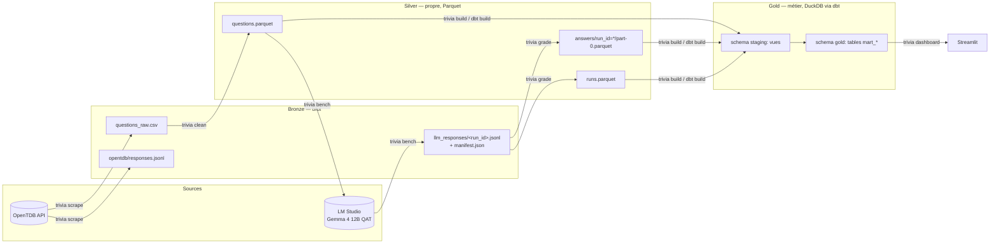

# SPEC — Trivial Poursuite · Benchmark d'un LLM local sur OpenTDB

| | |
|---|---|
| **Version** | 1.0 — 2026-09-10 |
| **Statut** | EN REVUE (aucune implémentation tant que la spec n'est pas validée) |
| **Auteurs** | Équipe M2 DEV (groupe de 3) + assistant |
| **Rendu** | 30 septembre 2026 — dépôt GitHub + README + application Streamlit |
| **Modèles évalués** | `google/gemma-4-12b-qat`, `qwen/qwen3.5-9b`, `mistralai/ministral-3-8b` — tous en GGUF via LM Studio 0.4.24 (section 1.4) |
| **Machine** | MacBook Pro Apple M2 Pro, 16 Go de mémoire unifiée, macOS |

Ce document est la **source de vérité** de l'implémentation. Toute divergence entre le code et la spec se résout en mettant la spec à jour d'abord, puis le code.

## Table des matières

- [0. Conventions de lecture](#0-conventions-de-lecture)
- [1. Contexte, objectifs et contraintes](#1-contexte-objectifs-et-contraintes)
- [2. Décisions d'architecture (ADR)](#2-décisions-darchitecture-adr)
- [3. Architecture globale](#3-architecture-globale)
- [4. Stack et versions épinglées](#4-stack-et-versions-épinglées)
- [5. Modèle de données (bronze, silver, gold)](#5-modèle-de-données)
- [6. Module `scrape` (OpenTDB → bronze)](#6-module-scrape)
- [7. Module `clean` (bronze → silver questions)](#7-module-clean)
- [8. Module `bench` (LM Studio → bronze réponses → silver answers)](#8-module-bench)
- [9. Notation des réponses (grading)](#9-notation-des-réponses-grading)
- [10. Couche gold avec dbt-duckdb](#10-couche-gold-avec-dbt-duckdb)
- [11. Dashboard Streamlit](#11-dashboard-streamlit)
- [12. Qualité : tests, lint, typage, CI](#12-qualité)
- [13. Plan du README](#13-plan-du-readme)
- [14. Procédure d'exécution pas à pas](#14-procédure-dexécution-pas-à-pas)
- [15. Risques, menaces à la validité](#15-risques-et-menaces-à-la-validité)
- [16. Questions ouvertes pour la revue](#16-questions-ouvertes-pour-la-revue)
- [Annexes](#annexes)

---

## 0. Conventions de lecture

Chaque affirmation technique porte une étiquette :

| Étiquette | Sens |
|---|---|
| **[VÉRIFIÉ]** | Testé empiriquement le 2026-09-10 sur la machine cible (tests de fumée, appels réels, versions installées). |
| **[DOC]** | Issu de la documentation officielle ou du code source de la bibliothèque, consulté le 2026-09-10 (voir `docs/research/`). |
| **[DÉCISION]** | Choix d'équipe, justifié dans la section 2. |
| **[À CONFIRMER]** | À vérifier en Phase 0 (`trivia check`) avant d'en dépendre. |

Les identifiants de code (fichiers, fonctions, colonnes, options CLI) sont en anglais. La documentation utilisateur (README, dashboard) est en français. Les prompts envoyés au modèle sont en anglais, car le jeu de données OpenTDB est en anglais.

Les six rapports de recherche qui fondent cette spec sont copiés dans `docs/research/` (avec un fichier `ERRATA.md` listant les points corrigés par vérification directe).

---

## 1. Contexte, objectifs et contraintes

### 1.1 Rappel des consignes

Construire un pipeline complet de data engineering et un rapport de benchmark :

1. **Étape 1** — scraper l'intégralité du jeu de questions OpenTDB.
2. **Étape 2** — interroger un LLM local (LM Studio) pour chaque question, en stockant `ai_answer`, `ai_correct` (booléen) et `response_time` (secondes), avec une trace de la formulation du prompt ; tester plusieurs variantes de prompt.
3. **Étape 3** — produire un rapport d'analyse : performance globale, par catégorie, par difficulté, par temps de réponse, comparaison de modèles, analyses exploratoires.

Architecture imposée : médaillon **bronze** (`questions_raw.csv`), **silver** (données nettoyées + réponses brutes du modèle, en Parquet), **gold** (tables métier, en DuckDB, construites avec **dbt**). Visualisation avec **Streamlit**. Livrables : dépôt GitHub, README (méthodologie, organisation, setup complet), application Streamlit.

### 1.2 Contraintes découvertes lors de la passe de documentation

| Contrainte | Détail | Conséquence |
|---|---|---|
| **Réseau d'entreprise** [VÉRIFIÉ] | Le réseau du bureau (Cato Networks) **bloque `opentdb.com`** (page de blocage HTTP 403, catégorie « Games ») et intercepte le TLS (CA « Cato Networks Root CA », absente des trousseaux macOS). PyPI, GitHub, Hugging Face, hub dbt et sites de doc sont accessibles avec un TLS normal. | Le scraping (≈ 25 min) doit être lancé **depuis un autre réseau** (domicile, partage de connexion mobile). Le scraper est conçu pour reprendre après interruption. |
| **Volume OpenTDB** [DOC, via proxy de lecture] | 5 298 questions « verified » (seul pool servi par l'API) sur 21 617 en base, 24 catégories (IDs 9 à 32), 50 questions max par appel, 1 appel / 5 s / IP. | 117 appels de données + 26 appels de service ≈ 12 min incompressibles, 20 à 35 min en pratique. |
| **Machine** [VÉRIFIÉ] | 16 Go unifiés. Les trois modèles pèsent 6,0 à 7,2 Go sur disque et 5,8 à 7,5 Gio en mémoire avec un contexte de 4 096 tokens. | Contexte limité à 4 096 tokens, un seul modèle chargé à la fois, exécution séquentielle. |
| **Format des modèles** [VÉRIFIÉ] | LM Studio sert les modèles GGUF par `llama.cpp` et les modèles MLX par `mlx-llm`, deux moteurs aux performances différentes. Le build MLX de la famille `qwen3_5` ignore la longueur de contexte demandée : son ajustement automatique la réécrit vers ce que la mémoire permet (32 768 obtenus pour 4 096 demandés). | Les deux modèles évalués sont chargés en **GGUF**, avec le même contexte et le même moteur : sans quoi l'écart de latence entre modèles mesurerait aussi l'écart entre moteurs. |
| **LM Studio** [VÉRIFIÉ] | Application 0.4.24, runtime `llama.cpp-mac-arm64-apple-metal-advsimd@2.34.0`, CLI `lms` dans `~/.lmstudio/bin` (pas dans le `PATH`). Serveur local sur le port 1234. Clé du modèle : `google/gemma-4-12b-qat`, architecture `gemma4`, contexte max 262 144. | Le Makefile et la CLI utilisent le chemin complet de `lms`. |
| **Gemma 4 « thinking »** [VÉRIFIÉ] | Le raisonnement est **actif par défaut**. Sans le désactiver, le modèle consomme tout son budget de tokens en raisonnement et ne répond pas (voir annexe A). Il se désactive **par requête** avec `reasoning: "off"` (API REST native `/api/v1/chat`) ou `reasoning_effort: "none"` (endpoint compatible OpenAI). Le SDK Python `lmstudio` 1.5.0 (dernière version stable, août 2025) **ne peut pas** le désactiver et laisse fuiter un marqueur interne dans le texte de réponse. | Le client LLM utilise l'API REST de LM Studio via `httpx` (ADR-04). |
| **Sortie structurée et statistiques** [VÉRIFIÉ] | LM Studio expose trois endpoints de complétion. `/api/v1/chat` renvoie les statistiques moteur et rejette les clés inconnues, mais refuse `response_format` (HTTP 400 `unrecognized_keys`). `/v1/chat/completions` accepte `response_format` mais ne renvoie aucun bloc `stats`. `/api/v0/chat/completions` accepte `response_format` de type `json_schema` **et** renvoie `stats`. | Une variante à sortie contrainte ne peut pas rester sur l'endpoint natif. Elle passe par `/api/v0/chat/completions`, seul des deux endpoints compatibles à renvoyer aussi les statistiques moteur : toutes les variantes portent ainsi les mêmes colonnes. |
| **Calendrier** | Sessions les 10, 11 et 30 septembre 2026. | Les runs longs (≈ 4 h de machine) se font entre les sessions ; tout est reprenable. |

### 1.3 Modèles évalués — ADR-15

Trois modèles, un par grand éditeur, tous exécutés localement dans la même configuration : build GGUF servi par `llama.cpp`, contexte de 4 096 tokens, un seul emplacement de prédiction. Les écarts mesurés viennent donc des modèles, pas du montage.

| Clé LM Studio | Éditeur | Paramètres | Quantization | Taille | Raisonnement |
|---|---|---|---|---|---|
| `google/gemma-4-12b-qat` | Google (États-Unis) | 12 B | Q4_0 (QAT) | 7,15 Go | actif par défaut, désactivé par requête |
| `qwen/qwen3.5-9b` | Alibaba (Chine) | 9 B | Q4_K_M | 6,55 Go | actif par défaut, désactivé par requête |
| `mistralai/ministral-3-8b` | Mistral (France) | 8 B | Q4_K_M | 6,06 Go | **absent du modèle** |

Le cas de Ministral mérite d'être souligné : son éditeur publie la version raisonnante comme un **modèle distinct** (`ministral-3-8b-reasoning`). La variante *Instruct* retenue ici ne contient aucune chaîne de pensée. Là où les deux autres exigent un paramètre par requête — qui dépend du template de chat appliqué correctement et peut donc cesser de fonctionner sans erreur —, ce modèle n'a rien à désactiver. Le garde-fou `ReasoningLeakError` couvre les trois de la même façon, mais il n'a rien à surveiller sur celui-ci.

### 1.4 Objectifs de qualité

- **Reproductibilité** : chaque run est décrit par un manifeste (modèle, quantization, versions, paramètres de génération, hash du jeu de données, commit git). Décodage glouton, exécution séquentielle, shuffle déterministe des options.
- **Rigueur statistique** : intervalles de Wilson sur toutes les proportions, test de McNemar apparié pour comparer deux variantes de prompt, baseline du hasard par type de question, catégories à petit effectif signalées.
- **Code propre** : `src/` layout, typage strict, tests unitaires sur toute la logique de notation, lint ruff, pre-commit, CI GitHub Actions.
- **Dashboard premium** : navigation multipage, thème clair/sombre cohérent, cartes KPI, graphiques Plotly homogènes (barres avec IC, heatmap, violons, ECDF), explorateur de questions.

---

## 2. Décisions d'architecture (ADR)

| ID | Décision | Alternatives écartées | Justification |
|---|---|---|---|
| **ADR-01** | Médaillon sur fichiers locaux : bronze = CSV + JSONL bruts, silver = Parquet (compression zstd), gold = fichier `.duckdb` construit par dbt. | Base Postgres, SQLite | Imposé par les consignes ; aucun serveur à opérer ; DuckDB lit le Parquet nativement [DOC]. |
| **ADR-02** | Projet `uv` unique, `src/` layout, package `trivia_bench`, CLI Typer `trivia` avec une commande par étape (`scrape`, `clean`, `check`, `bench`, `grade`, `build`, `dashboard`). | Poetry, notebooks, scripts épars | `uv` déjà installé (0.10.11), lockfile reproductible, `uv sync` unique pour un coéquipier [DOC]. |
| **ADR-03** | Polars pour toute la manipulation de données du pipeline ; pandas n'apparaît que comme dépendance transitive de Streamlit. Le dashboard lit DuckDB en Polars (`.pl()`). | pandas partout | Polars écrit le Parquet sans PyArrow, typage fort (`pl.Enum`, `pl.List`), interop DuckDB directe (`.pl()`) [VÉRIFIÉ]. Plotly Express 6.9 accepte les DataFrames Polars (via Narwhals), y compris pour `error_y` [VÉRIFIÉ]. |
| **ADR-04** | **Client LLM = API REST de LM Studio via `httpx`. L'endpoint découle de ce que la variante exige**, et la règle s'applique à l'identique à tous les modèles : `POST /api/v1/chat` pour les variantes en texte court (`reasoning: "off"`), `POST /api/v0/chat/completions` pour la variante à sortie contrainte (`reasoning_effort: "none"` + `response_format: json_schema`). Le SDK `lmstudio` n'est pas utilisé pour l'inférence. | Tout faire passer par `/api/v0/chat/completions` ; `/v1/chat/completions` pour la sortie contrainte ; SDK Python `lmstudio` ; package `openai` | L'endpoint natif rejette `response_format` : la variante contrainte ne peut pas y rester [VÉRIFIÉ, annexe A]. Des deux endpoints qui l'acceptent, `/api/v0/chat/completions` est le seul à renvoyer aussi les statistiques moteur, ce qui garde les mêmes colonnes pour toutes les variantes. Comme la règle ne dépend que de la variante, deux modèles se comparent toujours à endpoint égal. Les deux endpoints ont par ailleurs été mesurés équivalents (section 8.1). Le SDK 1.5.0 n'expose aucun champ pour désactiver le raisonnement et renvoie celui-ci mélangé à la réponse avec un marqueur interne. Le package `openai` n'apporte rien de plus que `httpx` et masquerait les champs propres à LM Studio. |
| **ADR-05** | **Raisonnement désactivé** pour tous les runs. L'axe « avec ou sans raisonnement » est abandonné. | Raisonnement activé partout, ou sur échantillon | Avec le raisonnement activé, le modèle génère 60 à 200 tokens de réflexion avant de répondre, soit environ 5 s par question au lieu de 0,9. Sur le jeu complet cela représenterait 7 h par variante, et 58 h pour couvrir deux modèles. Un échantillon aurait rendu cet axe incomparable aux autres, mesurés sur l'ensemble ; il est plus honnête de ne pas le traiter que de le traiter à une autre échelle. |
| **ADR-06** | Décodage glouton (`temperature=0`, `top_k=1`, `top_p=1`, `min_p=0`, `repeat_penalty=1.0`), instance chargée avec `--parallel 1`, exécution strictement séquentielle, premier appel de chauffe exclu des statistiques. | Sampling recommandé par Google (`temperature=1.0`, `top_p=0.95`, `top_k=64`) | Un benchmark veut la réponse la plus probable et des temps par question propres ; le batching concurrent fausse la latence et nuit à la reproductibilité [DOC]. |
| **ADR-07** | La notation (`grade`, `ai_correct`) est calculée **une seule fois en Python** au moment d'écrire la couche silver. dbt ne fait que de l'agrégation. | Notation en SQL dans dbt | Le fuzzy matching (rapidfuzz) n'a pas d'équivalent SQL identique ; une seule implémentation testée évite deux logiques divergentes. |
| **ADR-08** | `question_id` déterministe = `sha256` de (catégorie, type, difficulté, question, bonne réponse) normalisés. Ordre des options mélangé de façon déterministe par `random.Random(sha256(question_id))`, identique pour toutes les variantes et tous les modèles. | Index séquentiel ; `hash()` Python | OpenTDB n'a pas d'ID natif [DOC] ; `hash()` est randomisé par processus (PEP 456) ; le biais de position des LLM en QCM est documenté (Zheng et al., ICLR 2024). |
| **ADR-09** | Les réponses silver sont **partitionnées par run** (`data/silver/answers/run_id=<id>/part-0.parquet`, lecture Hive), jamais réécrites. Un run = un modèle × une variante × un mode de raisonnement. | Un seul `answers.parquet` réécrit | Écritures immuables, reprise sûre, lecture unifiée par glob dans DuckDB et Polars [DOC]. |
| **ADR-10** | dbt-core + dbt-duckdb, `profiles.yml` dans le dépôt (`--profiles-dir dbt`), target unique `prod`, macro `generate_schema_name` renvoyant le schéma personnalisé tel quel → schémas `staging` (vues) et `gold` (tables). Commandes dbt toujours lancées depuis la racine du dépôt. | Schéma `main` par défaut ; `dbt init` | Les chemins relatifs de dbt-duckdb se résolvent par rapport au répertoire courant ; sans surcharge de macro, tout tombe dans `main` [DOC, testé par l'agent de recherche]. |
| **ADR-11** | Streamlit ≥ 1.63 avec `st.navigation` et des pages-fonctions ; accès DuckDB par **connexions courtes** en lecture seule dans des fonctions `st.cache_data` ; thème clair + sombre dans `.streamlit/config.toml` ; Plotly 6.9 (`<7`) avec `theme="streamlit"`. | Connexion en `st.cache_resource` ; Altair | Une connexion DuckDB gardée ouverte par Streamlit **bloque `dbt build`** (verrou tenu tant que la connexion vit) [DOC, testé]. Plotly 7.0 (25 août 2026) n'apporte rien au projet et casse quelques API. |
| **ADR-12** | Les données sont **versionnées dans git** (bronze, silver, gold) pour un livrable auto-porteur, avec un budget de 60 Mo ; au-delà, Git LFS. Les prompts rendus ne sont pas stockés ligne à ligne (seulement leur hash), ils sont régénérables. | Données hors git | Les correcteurs doivent pouvoir lancer le dashboard sans relancer 4 h de benchmark. |
| **ADR-13** | Logs avec loguru ; tests avec pytest + pytest-httpx ; lint et format avec ruff ; typage mypy strict sur `src/` ; hooks pre-commit ; CI GitHub Actions (lint, tests, `dbt build` sur fixtures). | stdlib logging, black + flake8 | Moins de configuration, un seul outil de lint [DOC]. |
| **ADR-14** | Trois variantes de prompt (V1 lettre seule, V2 few-shot, V3 JSON contraint), chacune déclinée pour les questions booléennes. Toutes affichent les options, attendent une réponse courte, et seule change la manière d'obtenir le format. | Une variante en texte libre sans options affichées ; une variante « contrat de sortie » (convention OpenAI simple-evals) | Chaque variante retenue isole un mécanisme : instruction nue, démonstration par l'exemple, contrainte grammaticale. Deux ont été écartées après mesure. La variante en texte libre exigeait de juger du texte libre, avec une erreur de notation irréductible. La variante « contrat de sortie » impose la réponse en dernière ligne (`Answer: $LETTER`) : le modèle y délibère en prose sur 33 tokens de médiane malgré la consigne inverse du prompt système, et 10,5 % des réponses sont coupées par le budget de tokens avant d'atteindre la lettre. Son score mesurerait le budget accordé plutôt que la formulation. |
| **ADR-15** | **Trois modèles**, un par grand éditeur : `google/gemma-4-12b-qat`, `qwen/qwen3.5-9b`, `mistralai/ministral-3-8b` (variante *Instruct*). Tous en **build GGUF**, chargés à l'identique — contexte 4 096, un seul emplacement de prédiction — et évalués sur les trois mêmes variantes et le **jeu complet**. | Un seul modèle ; builds MLX ; échantillon stratifié pour les modèles secondaires ; variante *Reasoning* de Ministral | Consigne « comparaison de modèles ». Trois éditeurs (États-Unis, Chine, Europe) donnent un axe de comparaison défendable, là où trois modèles du même fournisseur n'auraient mesuré qu'une gamme. Le GGUF et non le MLX : les deux formats s'exécutent sur des moteurs différents (`llama.cpp` contre `mlx-llm`), et comparer les latences de modèles servis par deux moteurs mesurerait le moteur autant que le modèle ; le build MLX de la famille `qwen3_5` réécrit de surcroît la longueur de contexte demandée [VÉRIFIÉ : 32 768 obtenus pour 4 096 demandés]. La variante *Instruct* de Ministral et non la *Reasoning* : l'éditeur publie les deux comme des modèles distincts, si bien que le modèle évalué ne contient aucune chaîne de pensée — il n'y a rien à désactiver, donc rien qui puisse se réactiver silencieusement si un template de chat change. Les 16 Go ne permettent qu'un modèle chargé à la fois, d'où trois campagnes successives. Le jeu complet plutôt qu'un échantillon : une comparaison appariée question par question exige que les modèles voient les mêmes questions. |

---

## 3. Architecture globale

### 3.1 Pipeline médaillon



### 3.2 Arborescence du dépôt

```
trivia-bench/
├── README.md                      # méthodologie, organisation, setup (section 13)
├── SPEC.md                        # ce document
├── LICENSE                        # MIT pour le code ; données OpenTDB en CC BY-SA 4.0 (mention dans README)
├── Makefile                       # cibles: setup lint test scrape clean check bench grade build dashboard docs
├── pyproject.toml                 # projet uv, deps, ruff, pytest, mypy
├── uv.lock
├── .python-version                # 3.12
├── .env.example
├── .gitignore
├── .pre-commit-config.yaml
├── .github/workflows/ci.yml
├── .streamlit/config.toml         # thème clair/sombre, options serveur
├── src/trivia_bench/
│   ├── __init__.py                # __version__
│   ├── __main__.py
│   ├── py.typed
│   ├── cli.py                     # Typer: scrape, clean, check, bench, grade, build, dashboard
│   ├── config.py                  # Settings (pydantic-settings, préfixe TRIVIA_)
│   ├── logging.py                 # configuration loguru
│   ├── paths.py                   # DataPaths (bronze/silver/gold) dérivés de Settings
│   ├── ids.py                     # question_id, seeds déterministes, hash de prompt
│   ├── models.py                  # pydantic: RawQuestion, Question, LLMRequest, LLMResponse, AnswerRecord, RunManifest
│   ├── scrape/
│   │   ├── __init__.py
│   │   ├── client.py              # OpenTDBClient (httpx + pacing + tenacity + response_code)
│   │   ├── checkpoint.py          # état de reprise par catégorie
│   │   └── runner.py              # algorithme de scraping complet → bronze
│   ├── clean/
│   │   ├── __init__.py
│   │   ├── normalize.py           # unescape, strip, casefold, accents, articles, ponctuation
│   │   ├── shuffle.py             # ordre déterministe des options
│   │   └── builder.py             # bronze CSV → silver questions.parquet (Polars)
│   ├── bench/
│   │   ├── __init__.py
│   │   ├── lmstudio.py            # LMStudioClient (REST natif + OpenAI-compat), stats, erreurs
│   │   ├── prompts.py             # registre des variantes, rendu des templates, few-shot
│   │   ├── grading.py             # arbre de décision de notation
│   │   ├── manifest.py            # RunManifest: versions, config, hash dataset, git sha
│   │   ├── dataset.py             # chargement des questions, échantillonnage, exemples few-shot
│   │   ├── runner.py              # boucle séquentielle, warm-up, reprise, écriture JSONL
│   │   ├── silver.py              # JSONL bruts → answers/run_id=*/part-0.parquet + runs.parquet
│   │   ├── check.py               # vérifications LM Studio de la phase 0
│   │   └── preview.py             # rendu d'un prompt pour le débogage
│   ├── build/
│   │   ├── __init__.py
│   │   └── dbt.py                 # invocation dbtRunner + garde-fou verrou DuckDB
│   └── prompts/                   # templates versionnés (fichiers texte, un par variante et par type)
│       ├── VERSION                # ex. 2026-09-10.1
│       ├── v1_letter.{multiple,boolean}.txt
│       ├── v2_fewshot.{multiple,boolean}.txt
│       └── v3_json.{system,multiple,boolean}.txt
├── dbt/
│   ├── dbt_project.yml
│   ├── profiles.yml
│   ├── macros/
│   │   ├── generate_schema_name.sql
│   │   └── stats.sql              # wilson_lo, wilson_hi, chance_baseline
│   ├── models/
│   │   ├── staging/
│   │   │   ├── sources.yml
│   │   │   ├── stg_questions.sql
│   │   │   ├── stg_answers.sql
│   │   │   └── stg_runs.sql
│   │   └── marts/
│   │       ├── marts.yml          # descriptions + data_tests
│   │       ├── dim_question.sql
│   │       ├── dim_run.sql
│   │       ├── fct_answer.sql
│   │       ├── mart_run_summary.sql
│   │       ├── mart_accuracy_by_category.sql
│   │       ├── mart_accuracy_by_category_difficulty.sql
│   │       ├── mart_accuracy_by_difficulty.sql
│   │       ├── mart_accuracy_by_type.sql
│   │       ├── mart_grade_breakdown.sql
│   │       ├── mart_position_bias.sql
│   │       ├── mart_latency_by_run.sql
│   │       ├── mart_latency_drift.sql
│   │       ├── mart_variant_pairwise.sql
│   │       ├── mart_model_pairwise.sql
│   │       ├── mart_reasoning_pairwise.sql
│   │       ├── mart_question_consistency.sql
│   │       └── mart_answer_length.sql
│   └── tests/                     # tests singuliers
│       ├── assert_accuracy_within_wilson.sql
│       ├── assert_counts_are_consistent.sql
│       ├── assert_one_answer_per_question.sql
│       ├── assert_fewshot_examples_excluded.sql
│       ├── assert_no_reasoning_when_disabled.sql
│       └── assert_response_time_is_positive.sql
├── app/
│   ├── app.py                     # point d'entrée Streamlit (navigation, thème, filtres globaux)
│   ├── lib/
│   │   ├── db.py                  # connexions courtes DuckDB read-only + cache_data
│   │   ├── queries.py             # SQL paramétré par mart
│   │   ├── charts.py              # fabrique de figures Plotly homogènes
│   │   ├── stats.py               # McNemar, bootstrap (scipy/numpy) côté dashboard
│   │   ├── theme.py               # palette, constantes, CSS global
│   │   └── components.py          # cartes KPI, badges, en-têtes de page
│   ├── views/
│   │   ├── overview.py
│   │   ├── prompts.py
│   │   ├── categories.py
│   │   ├── latency.py
│   │   ├── explorer.py
│   │   ├── models.py
│   │   └── methodology.py
├── data/
│   ├── bronze/
│   │   ├── questions_raw.csv
│   │   ├── opentdb/responses.jsonl
│   │   ├── opentdb/checkpoint.json      # ignoré par git
│   │   └── llm_responses/<run_id>.jsonl + <run_id>.manifest.json
│   ├── silver/
│   │   ├── questions.parquet
│   │   ├── runs.parquet
│   │   └── answers/run_id=<run_id>/part-0.parquet
│   └── gold/
│       └── benchmark.duckdb
├── tests/
│   ├── conftest.py                # fabriques de questions, réglages de test
│   ├── test_ids.py
│   ├── test_normalize.py
│   ├── test_shuffle.py
│   ├── test_scrape_client.py
│   ├── test_scrape_runner.py
│   ├── test_clean_builder.py
│   ├── test_prompts.py
│   ├── test_grading.py
│   ├── test_lmstudio_client.py
│   ├── test_dataset.py
│   ├── test_bench_silver.py
│   └── test_dbt_build.py          # dbt build sur fixtures, vérifie les tables gold
└── docs/
    ├── research/                  # les 6 rapports + ERRATA.md
    └── img/                       # captures du dashboard pour le README
```

### 3.3 Enchaînement des commandes

| Cible Make | Commande sous-jacente | Réseau | Durée indicative |
|---|---|---|---|
| `make setup` | `uv sync` + `uv run pre-commit install` | PyPI | 1 à 2 min |
| `make lint` / `make test` | `uv run ruff check . && uv run ruff format --check .` / `uv run pytest` | — | < 1 min |
| `make scrape` | `uv run trivia scrape` | **OpenTDB (hors bureau)** | 20 à 35 min |
| `make clean` | `uv run trivia clean` | — | secondes |
| `make load-model` | `lms load google/gemma-4-12b-qat --context-length 4096 --gpu max --parallel 1 --identifier trivia-bench -y` | — | ≈ 30 s |
| `make check` | `uv run trivia check` | LM Studio local | 10 s |
| `make bench VARIANT=v1_letter` | `uv run trivia bench --variant v1_letter` | LM Studio local | 25 à 60 min par variante |
| `make bench-all` | boucle sur les 3 variantes | LM Studio local | ≈ 3 h 30 |
| `make grade` | `uv run trivia grade` | — | secondes |
| `make build` | `uv run trivia build` (= `dbt build --project-dir dbt --profiles-dir dbt --target prod`) | — | < 1 min |
| `make docs` | `dbt docs generate --static` | — | secondes |
| `make dashboard` | `uv run streamlit run app/app.py` | — | — |

---

## 4. Stack et versions épinglées

Versions vérifiées sur PyPI le 2026-09-10 [DOC]. Contraintes dans `pyproject.toml` en `>=` avec borne majeure ; le `uv.lock` fige les versions exactes.

| Package | Version | Rôle |
|---|---|---|
| Python | 3.12 (`.python-version`) | rapidfuzz exige ≥ 3.11 ; toute la stack supporte 3.12 |
| `uv` | 0.10.11 installé (0.12.x disponible ; `uv self update` conseillé, non bloquant) | gestion du projet |
| `httpx` | 0.28.1 (`<1`, la 1.0 est en pré-version) | client HTTP OpenTDB et LM Studio |
| `tenacity` | 9.1.4 | retries avec backoff |
| `polars` | 1.44.2 | bronze → silver, écriture Parquet |
| `pyarrow` | 25.0.1 (≠ 25.0.0, exclu par Streamlit) | requis par Streamlit |
| `duckdb` | 1.5.5 | lecture Parquet, backend dbt, dashboard |
| `dbt-core` | 1.12.4 | couche gold |
| `dbt-duckdb` | 1.11.0 | adaptateur |
| `pydantic` | 2.13.5 | modèles et validation |
| `pydantic-settings` | 2.15.0 | configuration `.env` |
| `typer` | 0.27.2 | CLI |
| `rich` | 15.0.0 | barres de progression, tables console |
| `loguru` | 0.7.3 | logs |
| `rapidfuzz` | 3.14.6 | fuzzy matching |
| `streamlit` | 1.63.0 | dashboard |
| `plotly` | 6.9.0 (`<7`) | graphiques |
| `scipy` | dernière 1.x | McNemar exact (`binomtest`), quantiles |
| `numpy` | transitif | bootstrap |
| dev : `pytest` 9.1.1, `pytest-httpx` 0.36.2, `ruff` 0.16.6, `mypy` 2.3.1, `pre-commit` 4.6.2 | | |

Éléments hors Python [VÉRIFIÉ] : LM Studio 0.4.24, runtime llama.cpp Metal 2.34.0, modèle `google/gemma-4-12b-qat` (Q4_0, 7,15 Go), `lms` CLI (`~/.lmstudio/bin/lms`), git 2.50, gh 2.98.

Points d'attention d'installation [DOC] :

- `dbt-core` dépend de `dbt-core-experimental-parser`, dont le build télécharge un wheel depuis une release GitHub. Sur le réseau d'entreprise (TLS intercepté), exporter `SSL_CERT_FILE=/etc/ssl/cert.pem` avant `uv sync` si l'installation échoue en `CERTIFICATE_VERIFY_FAILED` [À CONFIRMER : GitHub répond correctement en TLS depuis ce poste, le problème ne devrait pas se présenter].
- Build backend : `uv_build` (défaut de `uv init --package` depuis uv 0.7.19).

---

## 5. Modèle de données

Types Polars pour silver, types DuckDB pour gold. Toutes les dates sont en UTC.

### 5.1 Bronze — données brutes

**`data/bronze/questions_raw.csv`** (une ligne par question telle que renvoyée par l'API, sans nettoyage ; les champs texte sont décodés du base64 de transport mais ni « unescapés », ni « strippés »)

| Colonne | Type | Description |
|---|---|---|
| `scraped_at` | ISO 8601 UTC | Horodatage de l'appel API |
| `category_id` | int | ID OpenTDB (9 à 32) demandé dans l'appel |
| `category` | str | Libellé renvoyé par l'API (ex. `Entertainment: Film`) |
| `type` | str | `multiple` ou `boolean` |
| `difficulty` | str | `easy`, `medium`, `hard` |
| `question` | str | Texte brut |
| `correct_answer` | str | Texte brut |
| `incorrect_answers` | str | Liste JSON (`["a","b","c"]`) |
| `batch_index` | int | Numéro du lot dans la catégorie |
| `result_index` | int | Position dans le lot |

**`data/bronze/opentdb/responses.jsonl`** : une ligne par appel HTTP (URL, paramètres, `response_code`, corps JSON tel que reçu en base64, durée). Sert d'audit et de source pour reconstruire le CSV.

**`data/bronze/opentdb/checkpoint.json`** (ignoré par git) : `{ "token": "...", "categories": { "9": {"received": 469, "done": true}, ... }, "started_at": ... }`.

**`data/bronze/llm_responses/<run_id>.jsonl`** : une ligne par appel au modèle, écrite immédiatement après la réponse (source de vérité pour la reprise).

| Champ | Type | Description |
|---|---|---|
| `run_id` | str | Identifiant du run |
| `run_order` | int | Ordre d'exécution dans le run (0 = premier appel mesuré ; l'appel de chauffe n'est pas dans ce fichier) |
| `question_id` | str | sha256 hex |
| `prompt_variant` | str | `v1_letter`, `v2_fewshot`, `v3_json` |
| `prompt_version` | str | contenu de `prompts/VERSION` |
| `prompt_sha256` | str | hash du prompt rendu (system + user) |
| `transport` | str | `native` ou `openai` |
| `request` | objet | paramètres envoyés (sans le texte du prompt) |
| `response` | objet | corps JSON renvoyé par LM Studio, tel quel |
| `response_time` | float | secondes, `time.perf_counter()` autour de l'appel HTTP |
| `attempt` | int | numéro de tentative ayant réussi (1 = première) |
| `error` | str ou null | message si échec définitif après retries |
| `called_at` | ISO 8601 | horodatage de l'envoi |

**`data/bronze/llm_responses/<run_id>.manifest.json`** : voir `RunManifest` (section 8.6).

### 5.2 Silver — données propres (Parquet, zstd)

**`data/silver/questions.parquet`** — une ligne par question unique. Clé : `question_id`.

| Colonne | Type Polars | Description |
|---|---|---|
| `question_id` | `String` | sha256 hex (64 car.) — ADR-08 |
| `category_id` | `Int16` | 9 à 32 |
| `category` | `String` | libellé complet, unescapé |
| `category_group` | `String` | partie avant `: ` si présente (`Entertainment`, `Science`), sinon le libellé lui-même |
| `type` | `Enum["multiple","boolean"]` | |
| `difficulty` | `Enum["easy","medium","hard"]` | |
| `question` | `String` | `html.unescape`, espaces normalisés, strip |
| `correct_answer` | `String` | idem |
| `incorrect_answers` | `List[String]` | idem, ordre d'origine |
| `options` | `List[String]` | QCM : 4 options mélangées (ADR-08) ; booléen : `["True","False"]` fixe |
| `correct_index` | `Int8` | index de la bonne réponse dans `options` |
| `correct_letter` | `String` | `A`…`D` (QCM) ; `A`/`B` (booléen, non utilisé dans les prompts) |
| `n_options` | `Int8` | 4 ou 2 |
| `question_chars` | `Int32` | longueur du texte de la question |
| `question_words` | `Int32` | nombre de mots |
| `is_fewshot_example` | `Boolean` | `True` pour les 4 questions réservées aux exemples few-shot (exclues de l'évaluation) |
| `scraped_at` | `Datetime(UTC)` | |

Contraintes de validation (pydantic + tests) : `correct_answer ∉ incorrect_answers` ; `len(incorrect_answers) == 3` pour `multiple`, `== 1` pour `boolean` ; `correct_answer ∈ {"True","False"}` pour `boolean` ; unicité de `question_id`.

**`data/silver/answers/run_id=<run_id>/part-0.parquet`** — une ligne par (run, question). Clé : (`run_id`, `question_id`).

| Colonne | Type Polars | Description |
|---|---|---|
| `run_id` | `String` (partition Hive) | ex. `gemma-4-12b-qat__v1_letter__roff__20260911-0930` |
| `question_id` | `String` | |
| `model_key` | `String` | `google/gemma-4-12b-qat` |
| `model_quant` | `String` | `Q4_0` |
| `prompt_variant` | `Enum` | `v1_letter`, `v2_fewshot`, `v3_json` |
| `prompt_version` | `String` | |
| `reasoning_mode` | `Enum["off","on"]` | |
| `transport` | `Enum` | endpoint ayant servi la réponse |
| `prompt_sha256` | `String` | |
| `ai_answer` | `String` | texte brut renvoyé (`content`), peut être vide |
| `ai_reasoning` | `String` (nullable) | texte de raisonnement si `reasoning_mode = on` |
| `predicted_letter` | `String` (nullable) | lettre extraite (QCM) |
| `predicted_text` | `String` (nullable) | texte de l'option retenue (QCM) ou mot reconnu (booléen) |
| `ai_correct` | `Boolean` (non nul) | `True` si la réponse correspond à la bonne réponse ; `False` sinon, y compris `unparseable` et `error` |
| `grade` | `Enum` | `letter`, `exact`, `fuzzy`, `contains`, `wrong`, `unparseable`, `error` (section 9) |
| `grade_score` | `Float32` (nullable) | score rapidfuzz quand `grade = fuzzy` |
| `response_time` | `Float64` | secondes (wall-clock client) |
| `ttft_s` | `Float64` | `stats.time_to_first_token` : traitement du prompt avant le premier token |
| `tokens_per_second` | `Float64` | `stats.tokens_per_second` : débit de génération mesuré par le moteur |
| `prompt_tokens` | `Int32` | |
| `completion_tokens` | `Int32` | tokens générés (réponse + raisonnement) |
| `reasoning_tokens` | `Int32` | doit valoir 0 si `reasoning_mode = off` (test dbt) |
| `finish_reason` | `String` | `stop`, `length`, … |
| `run_order` | `Int32` | |
| `attempt` | `Int8` | |
| `called_at` | `Datetime(UTC)` | |
| `error` | `String` (nullable) | |

**`data/silver/runs.parquet`** — une ligne par run (aplatissement des manifestes) : `run_id`, `model_key`, `model_display_name`, `model_quant`, `model_size_bytes`, `instance_identifier`, `context_length`, `parallel`, `prompt_variant`, `prompt_version`, `reasoning_mode`, `transport`, `generation_params` (JSON string), `lmstudio_version`, `runtime_engine`, `python_version`, `package_version`, `git_sha`, `dataset_sha256`, `n_questions_planned`, `n_questions_done`, `n_errors`, `warmup_time_s`, `started_at`, `finished_at`, `machine` (JSON string : modèle de Mac, mémoire, macOS), `sample_spec` (ex. `all`, `stratified:400`, `limit:50`), `status` (`complete`, `partial`).

### 5.3 Gold — tables métier (DuckDB, schéma `gold`)

Grain et colonnes principales. Toutes les proportions sont accompagnées de `n`, `wilson_lo`, `wilson_hi` (z = 1,96). Les colonnes de run (`model_key`, `prompt_variant`, `reasoning_mode`) sont dénormalisées dans chaque mart pour simplifier les filtres du dashboard.

| Table | Grain | Colonnes clés | Question métier |
|---|---|---|---|
| `dim_question` | question | toutes les colonnes silver + `category_group` | référentiel des questions |
| `dim_run` | run | toutes les colonnes de `runs.parquet` | référentiel des runs et de leur configuration |
| `fct_answer` | (run, question) | colonnes silver answers + attributs question dénormalisés + `time_per_token`, `answer_chars`, `is_parsed` | grain d'analyse le plus fin (explorateur, stats appariées) |
| `mart_run_summary` | run | `n`, `n_correct`, `accuracy`, `wilson_lo/hi`, `n_unparseable`, `unparseable_rate`, `n_error`, `accuracy_parsed_only`, `chance_baseline` (moyenne pondérée 0,25/0,5), `accuracy_above_chance`, `median_response_time`, `p90`, `p95`, `mean`, `median_tokens_per_second`, `median_ttft_s`, `total_duration_s` | performance globale d'un run (modèle × variante) |
| `mart_accuracy_by_category` | (run, category) | `n`, `accuracy`, IC, `chance_baseline`, `accuracy_above_chance`, `n_flag_low` (`n < 30`), `rank_in_run` | précision par thème, catégories les plus dures |
| `mart_accuracy_by_category_difficulty` | (run, category, difficulty) | idem | heatmap catégorie × difficulté |
| `mart_accuracy_by_difficulty` | (run, difficulty) | idem + `chance_baseline` | facile vs difficile, calibration de la difficulté OpenTDB |
| `mart_accuracy_by_type` | (run, type) | idem + `chance_baseline` (0,25 / 0,5) | QCM vs vrai/faux, au-dessus du hasard |
| `mart_grade_breakdown` | (run, grade) | `n`, `share` | comment les bonnes réponses sont reconnues, taux d'échec de format |
| `mart_position_bias` | (run, correct_letter) et (run, predicted_letter) | `n`, `accuracy`, `share_predicted` | biais de position (QCM uniquement) |
| `mart_latency_by_run` | (run, type) | `median`, `p90`, `p95`, `mean`, `stddev` de `response_time` ; médianes de `tokens_per_second`, `ttft_s`, `time_per_token`, `prompt_tokens`, `completion_tokens` | temps de réponse par variante et type |
| `mart_latency_drift` | (run, bucket de 100 appels) | `bucket`, `median_response_time`, `median_tokens_per_second` | dérive thermique sur un run long |
| `mart_variant_pairwise` | (model, reasoning, variant_a, variant_b) | `n`, `both_correct`, `a_only`, `b_only`, `both_wrong` | comparaison appariée de deux formulations (McNemar dans le dashboard) |
| `mart_model_pairwise` | (variant, reasoning, model_a, model_b) | idem | comparaison appariée de deux modèles, à formulation égale |
| `mart_reasoning_pairwise` | (model, variant) | idem + `median_reasoning_tokens` | effet du raisonnement ; reste vide tant qu'aucun run ne l'active (ADR-05) |
| `mart_question_consistency` | (model, question) | `n_runs`, `n_correct`, `all_correct`, `all_wrong`, `is_mixed` | questions toujours ratées (ambiguës ?) ou instables |
| `mart_answer_length` | (run, ai_correct) | médiane/moyenne de `completion_tokens`, `answer_chars` | longueur vs exactitude |

Le schéma `staging` contient les vues `stg_questions`, `stg_answers`, `stg_runs` lisant directement les Parquet (`read_parquet`, Hive partitioning pour `answers`).

---

## 6. Module `scrape`

Objectif : télécharger **toutes** les questions « verified » d'OpenTDB dans la couche bronze, de façon reprenable, en respectant la limite de débit.

### 6.1 Faits API utilisés [DOC, `docs/research/01_opentdb.md`]

- `GET /api.php?amount=N&category=ID&encode=base64&token=T` — `amount` ∈ [1, 50], une seule catégorie par appel.
- `response_code` : 0 succès · 1 pas assez de questions (**tableau vide, pas de résultat partiel**) · 2 paramètre invalide · 3 token inconnu/expiré · 4 token épuisé pour ce filtre · 5 rate limit (1 appel / 5 s / IP). Le statut HTTP peut rester 200 : **toujours lire `response_code`**.
- `GET /api_token.php?command=request` → token de session (dédoublonnage global, expiration après 6 h d'inactivité).
- `GET /api_category.php` → 24 catégories ; `GET /api_count.php?category=ID` → `total_question_count` = nombre exact de questions verified.
- `encode=base64` : chaque champ texte (`category`, `type`, `difficulty`, `question`, `correct_answer`, éléments de `incorrect_answers`) est en base64 ; décodage `base64.b64decode(s).decode("utf-8")`.
- Licence des données : CC BY-SA 4.0 (attribution + partage à l'identique) → mention dans le README et la page « Méthodologie » du dashboard.

### 6.2 Algorithme

```
token = request_token()
categories = get_categories()                       # 24 entrées, futur-proof si l'API en ajoute
for cat in categories (ordre croissant d'ID):
    if checkpoint[cat].done: continue
    n_verified = get_count(cat.id)
    received = checkpoint[cat].received
    while received < n_verified:
        amount = min(50, n_verified - received)
        payload = get_questions(amount, cat.id, token)   # pacing 5,2 s + retries
        if payload.response_code in (1, 4): break         # pool épuisé (compte obsolète) → fin propre
        for q in payload.results:
            decode base64 → RawQuestion (pydantic) → append CSV + JSONL
        received += len(payload.results)
        checkpoint[cat].received = received; save()
    checkpoint[cat].done = True; save()
dedupe final du CSV sur question_id (ceinture et bretelles)
```

- **Pacing** : un limiteur global garantit ≥ 5,2 s entre deux requêtes, tous endpoints confondus (`time.monotonic()`).
- **Retries** (tenacity) : jusqu'à 6 tentatives, backoff exponentiel avec jitter (5 s → 60 s) sur `httpx.HTTPError`, timeouts, et sur `response_code = 5`. `response_code = 3` → nouveau token puis reprise. `response_code = 2` → erreur fatale (bug du scraper).
- **Reprise** : le checkpoint est écrit après chaque lot ; relancer `trivia scrape` reprend à la catégorie et au compteur exacts. Le CSV est ouvert en append ; la déduplication finale par `question_id` protège des doublons de reprise.
- **Timeouts httpx** : connect 10 s, read 30 s. `User-Agent: trivia-bench/<version> (+github url)`.
- **Erreur réseau bloquée (Cato)** : le client détecte une réponse HTML contenant `Corporate Internet policy violation` ou une erreur TLS et affiche un message explicite : « opentdb.com est bloqué sur ce réseau, relancer depuis un autre réseau ».

### 6.3 CLI

```
trivia scrape [--out-dir data/bronze] [--categories 9,10,11] [--min-interval 5.2]
              [--max-categories N] [--fresh]   # --fresh ignore le checkpoint
```

Sortie console (rich) : tableau par catégorie (attendu / reçu / appels / durée), total final, et un rappel de la licence. Journal loguru dans `logs/scrape_<ts>.log`.

### 6.4 Tests

`pytest-httpx` : séquence complète sur 2 catégories fictives (token → catégories → counts → lots), cas `response_code` 1/3/4/5, reprise depuis un checkpoint partiel, décodage base64 avec caractères non ASCII, détection de la page de blocage Cato. Le pacing est injecté (horloge factice) pour ne pas ralentir les tests.

---

## 7. Module `clean`

Objectif : produire `data/silver/questions.parquet` à partir de `questions_raw.csv`, avec un schéma fort, des identifiants stables, et l'ordre des options figé.

### 7.1 Transformations (Polars)

1. Lecture du CSV avec `schema_overrides` explicites ; `incorrect_answers` parsé depuis JSON.
2. Nettoyage de chaque champ texte : `html.unescape` (les données arrivent par base64 mais peuvent contenir des entités encodées à la source), normalisation des espaces (`" ".join(s.split())`), `strip`. Ces opérations sont appliquées via `map_elements` (seule `html.unescape` n'est pas vectorisable) sur ~5 300 lignes, coût négligeable.
3. `question_id = sha256("||".join(normalize(category), normalize(type), normalize(difficulty), normalize(question), normalize(correct_answer)))` où `normalize` = unescape + espaces normalisés + `casefold`. Les `incorrect_answers` n'entrent pas dans le hash (ordre non garanti côté API).
4. Déduplication sur `question_id` (garder la première occurrence), journaliser le nombre de doublons.
5. Validation pydantic `Question` (contraintes de la section 5.2) ; toute violation arrête le build avec la liste des lignes fautives.
6. Casting : `type` et `difficulty` en `pl.Enum`, `category_id` en `Int16`.
7. `options`, `correct_index`, `correct_letter` : mélange déterministe (section 7.2). Pour `boolean` : `options = ["True", "False"]`, `correct_index = 0 si correct_answer == "True" sinon 1`.
8. `category_group`, `question_chars`, `question_words`.
9. Sélection des exemples few-shot : les 2 premières questions `multiple` et les 2 premières `boolean` de la catégorie `General Knowledge` par `question_id` croissant, marquées `is_fewshot_example = True`. La sélection est **dérivée du jeu de données**, pas persistée dans un fichier du package : elle est déterministe pour un jeu donné, et un fichier annexe se serait retrouvé réécrit par les tests.
10. Écriture `write_parquet(compression="zstd")` + affichage d'un résumé (par catégorie, type, difficulté).

### 7.2 Mélange déterministe des options (ADR-08)

```python
def option_seed(question_id: str) -> int:
    return int(hashlib.sha256(question_id.encode()).hexdigest(), 16) % 2**32

def shuffle_options(question_id, correct_answer, incorrect_answers) -> tuple[list[str], int]:
    options = [*incorrect_answers, correct_answer]
    random.Random(option_seed(question_id)).shuffle(options)
    return options, options.index(correct_answer)
```

Propriétés testées : même entrée → même sortie sur deux processus ; distribution des `correct_index` approximativement uniforme sur le jeu complet (test statistique tolérant, chi² p > 0,01) ; la bonne réponse est toujours présente une seule fois.

### 7.3 CLI et tests

```
trivia clean [--in data/bronze/questions_raw.csv] [--out data/silver/questions.parquet]
```

Tests : fixture CSV de 12 lignes couvrant entités HTML, accents, doublon exact, doublon après normalisation, question booléenne, espaces parasites ; vérification du schéma Parquet, des enums, des IDs, du mélange, de l'exclusion few-shot.

---

## 8. Module `bench`

Objectif : interroger le modèle pour chaque question avec une variante de prompt donnée, mesurer, tracer, et écrire les réponses brutes dans la couche bronze, puis (commande `grade`) les réponses notées dans la couche silver.

### 8.1 Client LM Studio (`bench/lmstudio.py`) — ADR-04

Une classe `LMStudioClient(base_url, model_key, timeout)` avec :

- `health() -> ServerInfo` : `GET /api/v1/models` → vérifie que `model_key` est présent et chargé (`loaded_instances` non vide), renvoie `context_length`, `parallel`, `capabilities.reasoning` [VÉRIFIÉ : le champ existe et l'instance chargée expose `contextLength: 4096`, `parallel: 4` par défaut].
- `complete(req: LLMRequest) -> LLMResponse` : route vers l'endpoint qu'exige la variante, puis normalise la réponse.
- `loaded_runtime()` : `GET /api/v0/models` → format servi (`gguf` ou `mlx`, donc le moteur d'inférence), quantization et **longueur de contexte réellement appliquée**, que LM Studio peut avoir ajustée. Relevé sans consommer d'inférence et quel que soit l'endpoint de la variante ; recopié dans le manifeste.

**Variantes en texte court** — `POST /api/v1/chat` [VÉRIFIÉ] :

```json
{
  "model": "google/gemma-4-12b-qat",
  "system_prompt": "...",            // omis si la variante n'a pas de prompt système
  "input": "...",
  "reasoning": "off",
  "temperature": 0, "top_k": 1, "top_p": 1.0, "min_p": 0.0, "repeat_penalty": 1.0,
  "max_output_tokens": 8,
  "store": false
}
```

Réponse exploitée : `output[]` (`type: "message"` → `content` ; `type: "reasoning"` → `ai_reasoning`), `stats.input_tokens`, `stats.total_output_tokens`, `stats.reasoning_output_tokens`, `stats.tokens_per_second`, `stats.time_to_first_token_seconds`. Cet endpoint renvoie HTTP 400 `unrecognized_keys` pour toute clé inconnue, ce qui protège contre une faute de frappe dans un paramètre de décodage.

**Variante à sortie contrainte** — `POST /api/v0/chat/completions` [VÉRIFIÉ] :

```json
{
  "model": "google/gemma-4-12b-qat",
  "messages": [{"role":"system","content":"..."},{"role":"user","content":"..."}],
  "reasoning_effort": "none",
  "temperature": 0, "top_k": 1, "top_p": 1.0, "min_p": 0.0, "repeat_penalty": 1.0,
  "max_tokens": 24,
  "response_format": {"type":"json_schema","json_schema":{"name":"trivia_answer","strict":true,"schema":{...}}}
}
```

Réponse exploitée : `choices[0].message.content`, `choices[0].message.reasoning_content` (doit être vide), `choices[0].finish_reason`, `usage.prompt_tokens`, `usage.completion_tokens`, `usage.completion_tokens_details.reasoning_tokens`, `stats.time_to_first_token`, `stats.tokens_per_second`. Cet endpoint **ignore silencieusement les clés inconnues** (HTTP 200 avec un paramètre fantaisiste) : les noms des paramètres de décodage y sont garantis par un test unitaire sur le corps de requête et par le contrôle de déterminisme de `trivia check`.

**Équivalence des deux endpoints** [VÉRIFIÉ]. Comparer deux variantes servies par deux endpoints n'est valide que si ceux-ci mesurent la même chose. Mesure sur 40 questions appariées, en alternant l'ordre des deux appels pour qu'aucun ne bénéficie systématiquement du cache de prompt :

| | `/api/v1/chat` | `/api/v0/chat/completions` |
|---|---|---|
| Réponses différentes | 0 sur 40 | |
| TTFT médian (cache froid) | 0,139 s | 0,138 s |
| Débit médian | 21,4 tok/s | 21,4 tok/s |

**Garde-fou raisonnement** : si `reasoning_mode = off` et que la réponse contient des tokens de raisonnement (`reasoning_output_tokens > 0` ou `reasoning_tokens > 0`), le run s'arrête avec une erreur explicite (invariant du benchmark).

**Erreurs et retries** : `httpx.HTTPError`, timeouts (120 s par appel, 600 s si raisonnement activé) et HTTP 5xx → jusqu'à 3 tentatives avec backoff (1 s, 2 s, 4 s). HTTP 4xx → erreur immédiate (bug de requête). Après échec définitif, l'enregistrement est écrit avec `error` renseigné et le run continue ; le résumé final liste les erreurs, et `trivia bench --resume` les rejoue.

**Mesure du temps** : `response_time = perf_counter()` autour de l'appel HTTP complet (inclut la sérialisation et le transport local, négligeables : ≈ 0,23 s mesurés pour une réponse de 2 tokens, dont 0,13 s de TTFT [VÉRIFIÉ]).

### 8.2 Variantes de prompt (`bench/prompts.py`, `prompts/*.txt`) — ADR-14

Registre `PROMPT_VARIANTS: dict[str, PromptVariant]` avec, pour chaque variante : `id`, `label`, `system` (par type de question, optionnel), `user_template` (par type), `max_tokens` (par type), `json_schema` (V4 uniquement), les drapeaux `has_system`, `use_fewshot`, `structured` et `answer_cue` qui pilotent le rendu et la notation, `order` et `description` (affichée dans le dashboard). Les templates vivent dans des fichiers texte versionnés ; `prompts/VERSION` (`2026-09-10.1`) est recopié dans chaque enregistrement. Rendu par `str.format` avec des placeholders `{question}`, `{A}`…`{D}`, `{examples}`.

Le prompt système est envoyé comme vrai tour `system` : Gemma 4 le supporte nativement et le template de chat embarqué dans le GGUF (« Google Gemma 4 Canonical Chat Template », publié le 2026-07-09) est appliqué par LM Studio [VÉRIFIÉ, `prediction_config.promptTemplate` observé].

| ID | Système | Template utilisateur (QCM) | Template utilisateur (booléen) | `max_tokens` | Ce que la variante isole |
|---|---|---|---|---|---|
| `v1_letter` | aucun | `Question: {question}\n\nA) {A}\nB) {B}\nC) {C}\nD) {D}\n\nAnswer with the letter only (A, B, C, or D). Do not explain.` | `Statement: {question}\n\nIs this statement True or False?\n\nAnswer with one word only: True or False.` | 8 | conformité de format sur instruction nue + reconnaissance |
| `v2_fewshot` | aucun | `Answer each multiple choice question with only the letter of the correct answer.\n\n{examples}\n\nQuestion: {question}\nA) {A}\nB) {B}\nC) {C}\nD) {D}\nAnswer:` où `{examples}` = 2 blocs `Question/A–D/Answer: X` fixes | `Answer each statement with only True or False.\n\n{examples}\n\nStatement: {question}\nAnswer:` | 8 | démonstration du format en contexte |
| `v3_json` | `You answer trivia questions. Respond only with a single JSON object matching the given schema. Do not include any text outside the JSON object.` | `Question: {question}\n\nA) {A}\nB) {B}\nC) {C}\nD) {D}` avec schéma `{"answer": enum[A,B,C,D]}` | `Statement: {question}` avec schéma `{"answer": enum[True,False]}` | 24 | décodage contraint par grammaire : format garanti, effet sur l'exactitude |

Les templates ci-dessus sont normatifs (annexe B les reproduit verbatim avec les échappements).

### 8.3 Boucle d'exécution (`bench/runner.py`)

```
questions = silver questions where not is_fewshot_example, filtrées par --sample/--limit, triées par question_id
run_id = f"{model_slug}__{variant}__r{off|on}__{YYYYMMDD-HHMM}"  (ou --resume RUN_ID)
manifest = build_manifest(...)                     # section 8.6, écrit avant le premier appel
done_ids = ids présents dans le JSONL existant si --resume
warmup: 1 appel sur une question fixe hors jeu, durée stockée dans le manifeste, non enregistré
for i, q in enumerate(questions):
    if q.id in done_ids: continue
    req = render(variant, q)                       # system, user, json_schema, max_tokens
    resp = client.complete(req)                    # retries internes
    append_jsonl(record(run_id, i, q, req, resp))  # flush immédiat
    progress.advance()
manifest.finished_at, n_done, n_errors, status → réécriture du manifeste
```

- Exécution strictement séquentielle (ADR-06). Aucune parallélisation, même via asyncio.
- Barre de progression rich avec ETA, taux d'erreurs, dernier temps de réponse.
- Interruption (`Ctrl+C`) propre : le manifeste passe en `partial`, reprise avec `--resume`.
- Durées mesurées en campagne sur les 5 257 questions évaluées : V1 · Lettre seule 0,751 s de temps médian, V2 · Few-shot 0,903 s, V3 · JSON contraint 1,371 s — le décodage contraint et le transport compatible OpenAI coûtent près du double d'une lettre générée librement. Compter environ 3 h 30 pour les trois variantes, hors interruptions.

### 8.4 Échantillonnage

- `--limit N` : les N premières questions (par `question_id`), pour les tests rapides.
- `--sample stratified:N` : N questions réparties proportionnellement par (`category`, `difficulty`, `type`) avec un tirage `random.Random(20260910)`, minimum 1 par strate ; la liste des IDs est enregistrée dans le manifeste pour que toutes les variantes évaluées sur cet échantillon voient les mêmes questions.
- Par défaut : toutes les questions (hors few-shot).

### 8.5 CLI

```
trivia check                                     # Phase 0 (section 14.4)
trivia bench --variant v1_letter [--model google/gemma-4-12b-qat] [--reasoning off|on]
             [--limit N | --sample stratified:N] [--resume RUN_ID] [--max-tokens N]
trivia bench --all-variants [--sample ...]       # boucle v1..v4, séquentiellement
trivia grade [--run-id RUN_ID | --all] [--force] # bronze JSONL → silver answers + runs.parquet (idempotent)
trivia prompt --variant v2_fewshot --question-id <id>        # affiche le prompt rendu (debug/README)
```

`trivia grade` est séparé de `bench` pour pouvoir **re-noter** tous les runs si la logique de notation évolue (la notation est déterministe et rapide), sans réinterroger le modèle. `bench` appelle `grade` automatiquement en fin de run.

### 8.6 Manifeste de run (`bench/manifest.py`)

Collecté au démarrage : `run_id`, `model_key`, `model_display_name`, `model_quant`, `model_size_bytes`, `instance_identifier`, `context_length`, `parallel` (depuis `GET /api/v1/models`) ; `lmstudio_version` (lu dans `/Applications/LM Studio.app/Contents/Info.plist`, clé `CFBundleShortVersionString`, sinon `unknown`) ; `runtime_engine` (ligne « selected » de `lms runtime ls`) ; `prompt_variant`, `prompt_version`, `reasoning_mode`, `transport`, `generation_params` ; `python_version`, `package_version`, `git_sha` (`git rev-parse HEAD`, sinon null) ; `dataset_sha256` (hash de `questions.parquet`) ; `sample_spec`, `n_questions_planned` ; `machine` (`sysctl machdep.cpu.brand_string`, `hw.memsize`, `sw_vers`) ; `started_at`. Complété en fin de run : `finished_at`, `n_questions_done`, `n_errors`, `warmup_time_s`, `status`.

### 8.7 Tests

`pytest-httpx` : le corps de requête exact (noms des paramètres de décodage, `reasoning_effort`, schéma JSON), le parsing des statistiques, l'identité du chemin appelé pour toutes les variantes, la présence des statistiques y compris sur sortie contrainte, HTTP 400 → échec immédiat, 5xx → retries, timeout ; garde-fou raisonnement ; rendu des 3 variantes × 2 types (snapshots texte) ; reprise (`--resume` ignore les IDs déjà présents) ; manifeste (champs obligatoires, sérialisation) ; conversion JSONL → Parquet.

---

## 9. Notation des réponses (grading)

Objectif : décider `grade` et `ai_correct` de façon déterministe, testée, et auditable. Implémentée dans `bench/grading.py`, appliquée par `trivia grade` (ADR-07).

### 9.1 Normalisation (`clean/normalize.py`, réutilisée)

`normalize_answer(s)` = `html.unescape` → suppression des accents (NFKD, retrait des marques combinantes) → `casefold` → ponctuation remplacée par des espaces (ce qui retire aussi la mise en forme Markdown `*`, `**`, `` ` `` que Gemma 4 produit spontanément en texte libre, ex. « The *Mona Lisa* was painted by … **Leonardo da Vinci**. » [VÉRIFIÉ]) → suppression des articles `a`, `an`, `the` → espaces normalisés. Superset du `normalize_answer` canonique de SQuAD.

### 9.2 Vocabulaire

| `grade` | `ai_correct` | Signification |
|---|---|---|
| `letter` | True | lettre extraite (regex ou JSON) égale à `correct_letter` |
| `exact` | True | texte normalisé égal à la bonne réponse (ou au texte de l'option correcte) ; booléen : mot `true`/`false` exact |
| `fuzzy` | True | `fuzz.ratio` ≥ 90 avec le texte de l'option, et écart ≥ 5 points avec la deuxième meilleure (QCM) ; booléen : la réponse entière est un synonyme (`yes`/`no`/`y`/`n`/`t`/`f`/`correct`/`incorrect`) |
| `contains` | True | bonne réponse (≥ 3 caractères) contenue dans la réponse, une seule option citée, sans négation dans les 2 mots précédents, et réponse non tronquée (section 9.5) |
| `wrong` | False | une réponse a été identifiée, elle est fausse |
| `unparseable` | False | aucune réponse identifiable (vide, refus, hors format) |
| `error` | False | appel échoué après retries |

`ai_correct` est non nul pour satisfaire la définition des consignes (« True si la réponse IA correspond à la bonne réponse »). Le dashboard et la couche gold rapportent aussi `accuracy_parsed_only` (dénominateur sans `unparseable`/`error`) et le taux d'`unparseable`, pour distinguer échec de connaissance et échec de format.

### 9.3 Arbre de décision

```
grade(answer_text, question, variante, tronquee):
  if error: return ("error", False)

  # --- Lecture prealable du JSON (v3_json) ---
  # Avant l'aiguillage par type : sinon une reponse vrai/faux parfaitement conforme
  # ({"answer": "False"}) serait notee par rapprochement au lieu d'etre reconnue exacte.
  if variante.structured et json.loads(...)["answer"] existe:
      answer_text = cette valeur

  # --- Vrai/faux ---
  if question.type == boolean:
      si variante.answer_cue : extraire ce qui suit "answer:"
      token = normalize(answer_text)
      if token vide: unparseable
      if token in {true} | {false}: exact
      elif token in {yes, y, t, correct} | {no, n, f, incorrect}: fuzzy   # la reponse entiere
      elif exactement un mot parmi {true,yes,correct} / {false,no,incorrect}: contains
      else: unparseable

  # --- Choix multiples ---
  letter = extract_letter(answer_text, structured=variante.structured)
  #   structure : json.loads → obj["answer"] ∈ {A,B,C,D}
  #   puis regex ancree      ^\s*\(?([A-Da-d])\)?(?:[.):\-\s]|$)
  #   puis marqueur          (?i)\banswer\s*(?::|is)\s*\$?\**\s*\(?([A-Da-d])\)?\b
  #   puis lettre isolee en fin de texte, si celui-ci fait ≤ 3 mots
  if letter: return ("letter", letter == correct_letter) si juste, sinon ("wrong", False)

  matched = match_option_text(answer_text, options, contains_autorise = not tronquee)
  #   exact → fuzzy(ratio ≥ 90, marge ≥ 5 avec la 2e option) → contains(unique, sans negation)
  if matched: return (methode, matched.index == correct_index) …

  # Le refus n'est cherche qu'ici, en dernier : une reponse hesitante mais juste
  # (« je ne suis pas sur, mais False ») doit etre creditee.
  return ("unparseable", False)
```

Garde anti-négation : `not`, `n't`, `never`, `except`, `neither`, `nor`, `isn`, `wasn`, `aren`, `no` dans les **2 mots** précédant le segment apparié.

Refus : deux listes distinctes, car les confondre produit des faux positifs. Une liste d'**égalités exactes** (`n/a`, `unknown`, `none`, `no answer`, `not sure`, `no comment`) — testée en sous-chaîne, « n a » ferait passer « born in austria » pour un refus. Une liste de **locutions** cherchées en sous-chaîne (`i don't know`, `cannot answer`, `no idea`, `unable to`, `impossible to say`…). Le refus est évalué **en dernier**, après avoir cherché une réponse.

### 9.5 Réponses tronquées

Le budget de tokens de chaque variante peut couper une réponse. Une réponse coupée est une preuve incomplète : la suite manquante peut contredire ce qui a été reçu. Le rapprochement par **sous-chaîne** est donc désactivé sur une réponse tronquée : c'est la seule règle dont le verdict puisse être renversé par la suite du texte. « The character Daryl Dixon does not have a » en est l'exemple type — l'option y est citée juste avant d'être niée, et la négation tombe hors du texte reçu.

Les autres règles restent actives : une lettre ancrée en tête, une égalité exacte ou un rapprochement approché ne peuvent pas être inversés par la suite du texte. La troncature est calculée là où elle sert, au moment de la notation (`completion_tokens >= max_tokens`), et transmise à la couche gold dans `is_truncated` plutôt que recalculée en SQL.

### 9.4 Tests (table de vérité)

70 cas paramétrés couvrant : `"B"`, `"B)"`, `"(b)"`, `"B. Pomodoro"`, `"Answer: B"`, `"The answer is B"`, `"Pomodoro"`, `"pomodoro."`, `"It's Pomodoro"`, `"Not Aglio, Pomodoro"`, `"Aglio"` (wrong), `"I don't know"` (unparseable), `""`, `"True"`, `"true."`, `"Yes"`, `"False, it was Austria"`, `"Neither true nor false"` (unparseable), JSON valide/invalide, réponses avec accents et entités HTML, bonne réponse citée puis niée, et réponses tronquées (sous-chaîne refusée, lettre et exact conservés). Chaque cas fixe `grade` **et** `ai_correct`.

---

## 10. Couche gold avec dbt-duckdb

### 10.1 Configuration [DOC, `docs/research/03_dbt_duckdb.md`, testé par l'agent]

`dbt/dbt_project.yml`

```yaml
name: trivia_bench
version: "1.0.0"
profile: trivia_bench
model-paths: ["models"]
macro-paths: ["macros"]
test-paths: ["tests"]
target-path: "target"
clean-targets: ["target", "dbt_packages"]
models:
  trivia_bench:
    staging:
      +materialized: view
      +schema: staging
    marts:
      +materialized: table
      +schema: gold
```

`dbt/profiles.yml` (dans le dépôt, ADR-10)

```yaml
trivia_bench:
  target: prod
  outputs:
    prod:
      type: duckdb
      path: "{{ env_var('TRIVIA_DUCKDB_PATH', 'data/gold/benchmark.duckdb') }}"
      threads: 4
      retries:
        connect_attempts: 5      # attend qu'un lecteur libère le verrou
```

`dbt/macros/generate_schema_name.sql` — renvoie `custom_schema_name` tel quel (sinon le schéma cible), pour obtenir `staging` et `gold` sans préfixe quel que soit le target.

`dbt/models/staging/sources.yml`

```yaml
version: 2
sources:
  - name: silver
    meta:
      external_location: "read_parquet('{{ env_var('TRIVIA_SILVER_DIR', 'data/silver') }}/{name}.parquet')"
    tables:
      - name: questions
      - name: runs
      - name: answers
        config:
          external_location: "read_parquet('{{ env_var('TRIVIA_SILVER_DIR', 'data/silver') }}/answers/**/*.parquet', hive_partitioning = true)"
```

Règles : `dbt` est toujours lancé **depuis la racine du dépôt** (chemins relatifs résolus par rapport au répertoire courant). `trivia build` fixe le répertoire courant, exporte les variables d'environnement, puis appelle `dbtRunner().invoke(["build", "--project-dir", "dbt", "--profiles-dir", "dbt", "--target", "prod"])`.

Le build écrit dans `data/gold/.build/benchmark.duckdb` puis remplace atomiquement `data/gold/benchmark.duckdb` (`os.replace`) : les lecteurs Streamlit déjà ouverts ne cassent pas, et un dashboard en cours d'utilisation ne bloque pas le build (ADR-11). Deux détails d'implémentation valent d'être notés, chacun ayant coûté un bug :

- le fichier temporaire porte le **même nom** dans un sous-dossier, et non `benchmark.build.duckdb` : dbt-duckdb dérive le nom du catalogue du nom de fichier, et le point cassait les références qualifiées stockées dans les vues (`Catalog "benchmark.build" does not exist`) ;
- avant le remplacement, les connexions dbt sont fermées (`reset_adapters()`) puis un `CHECKPOINT` est forcé, et la publication est **refusée si la base construite est vide**. Sans cela, dbt gardant sa connexion ouverte, on déplaçait un fichier dont les tables n'étaient pas encore écrites — ce qui fonctionnait par accident tant que les lecteurs suivaient l'inode.

### 10.2 Macros

- `wilson_lo(successes, trials, z=1.96)` et `wilson_hi(...)` → bornes de l'intervalle de Wilson en arithmétique pure (`nullif(trials, 0)`), appelées comme deux expressions de colonne. Deux macros plutôt qu'une seule renvoyant deux colonnes : DuckDB n'accepte pas de fonction table définie en Jinja.
- `chance_baseline(type_col)` → `case when type = 'multiple' then 0.25 else 0.5 end` ; pour un groupe mixte : `avg(...)` pondéré par le nombre de questions.

### 10.3 Modèles

Staging (vues) : `stg_questions`, `stg_answers`, `stg_runs` — sélection et typage explicite des colonnes, sans logique.

Marts (tables), SQL DuckDB. Extraits normatifs :

`fct_answer`

```sql
select
    a.run_id, a.question_id, a.model_key, r.model_short,
    a.prompt_variant, r.variant_label, a.reasoning_mode, a.transport,
    q.category, q.category_group, q.difficulty, q.type, q.n_options,
    q.correct_letter, q.correct_answer, q.question,
    a.ai_answer, a.predicted_letter, a.predicted_text, a.ai_correct, a.grade,
    a.grade not in ('unparseable', 'error')      as is_parsed,
    case when q.type = 'multiple' then 0.25 else 0.5 end as chance_baseline,
    a.response_time, a.ttft_s, a.tokens_per_second,
    a.response_time / nullif(a.completion_tokens, 0) as time_per_token,
    a.max_tokens, a.is_truncated,
    length(a.ai_answer)                          as answer_chars
from {{ ref('stg_answers') }} as a
inner join {{ ref('stg_questions') }} as q using (question_id)
inner join {{ ref('dim_run') }} as r using (run_id)
```

Les colonnes sont énumérées plutôt que reprises par `a.*` : le dashboard s'appuie sur cette liste, et un `select *` y ferait entrer silencieusement toute colonne ajoutée en amont. La jointure porte sur `dim_run` et non sur `stg_runs`, pour hériter des libellés dérivés (`model_short`, `variant_label`) sans les recalculer. Le débit rapporté est celui du moteur (`tokens_per_second`, nul sur le transport compatible OpenAI) : un débit dérivé du temps de paroi mêlerait le coût du prompt à celui de la génération et serait trompeur sur des réponses de deux tokens.

`mart_run_summary` (grain run) :

```sql
with agg as (
  select run_id, model_key, prompt_variant, reasoning_mode,
         count(*) as n,
         count_if(ai_correct) as n_correct,
         count_if(grade = 'unparseable') as n_unparseable,
         count_if(grade = 'error') as n_error,
         count_if(ai_correct) filter (where is_parsed) as n_correct_parsed,
         count_if(is_parsed) as n_parsed,
         avg(case when type = 'multiple' then 0.25 else 0.5 end) as chance_baseline,
         median(response_time) as median_response_time,
         quantile_cont(response_time, 0.9) as p90_response_time,
         quantile_cont(response_time, 0.95) as p95_response_time,
         avg(response_time) as mean_response_time,
         median(tokens_per_second) as median_tokens_per_second,
         median(ttft_s) as median_ttft_s,
         sum(response_time) as total_duration_s
  from {{ ref('fct_answer') }} group by all
)
select agg.*,
       n_correct::double / n as accuracy,
       n_correct_parsed::double / nullif(n_parsed, 0) as accuracy_parsed_only,
       n_unparseable::double / n as unparseable_rate,
       n_correct::double / n - chance_baseline as accuracy_above_chance,
       {{ wilson_lo('n_correct', 'n') }} as wilson_lo,
       {{ wilson_hi('n_correct', 'n') }} as wilson_hi
from agg
```

Les autres marts suivent le même patron avec leur grain (section 5.3). `mart_variant_pairwise` fait une auto-jointure de `fct_answer` sur `question_id` pour deux runs de même modèle et même `reasoning_mode` (`variant_a < variant_b`) et compte les quatre cases de la table de contingence. `mart_latency_drift` utilise `floor(run_order / 100)`. `mart_position_bias` se limite à `type = 'multiple'` et croise `correct_letter` et `predicted_letter`.

### 10.4 Tests dbt

- Génériques (`data_tests:`) : `unique` + `not_null` sur `question_id` et `run_id` ; `accepted_values` sur `grade`, `type`, `difficulty`, `prompt_variant`, `reasoning_mode`, `transport`, `status` ; `not_null` sur les proportions ; `relationships` de `fct_answer.question_id` vers `dim_question`. Le projet n'installe **aucun package dbt** : les quelques tests que `dbt_utils` aurait apportés sont écrits en SQL dans `dbt/tests/`, ce qui évite une dépendance réseau au build pour trois requêtes.
- Singuliers : `assert_accuracy_within_wilson` (`wilson_lo ≤ accuracy ≤ wilson_hi`), `assert_counts_are_consistent` (les modes de reconnaissance, les réponses fausses, inexploitables et en erreur couvrent le total), `assert_one_answer_per_question` (une seule ligne par couple `(run_id, question_id)` — l'invariant que casserait une reprise mal dédupliquée), `assert_no_reasoning_when_disabled` (`reasoning_tokens = 0` quand `reasoning_mode = 'off'`), `assert_response_time_is_positive`, `assert_fewshot_examples_excluded` (aucune réponse sur une question `is_fewshot_example`).
- `dbt docs generate --static` → `dbt/target/static_index.html` publié dans `docs/` comme livrable complémentaire.

---

## 11. Dashboard Streamlit

### 11.1 Principes

- **Une histoire, sept pages** : de la vue d'ensemble vers le détail, chaque page répond à une question métier et commence par une phrase de synthèse calculée à partir des données (ex. « V3 · JSON contraint obtient 73,3 % [72,1 ; 74,5] sur 5 257 questions »).
- **Filtres globaux dans la barre latérale** (définis dans `app.py`, persistants entre pages) : modèle, mode de raisonnement, variantes visibles. Les pages ajoutent leurs filtres locaux.
- **Cohérence visuelle** : toutes les figures passent par `lib/charts.py` (marges, police, grille discrète, fond transparent, `hovertemplate` lisible, format `.1%`, barres d'erreur Wilson asymétriques, palette du thème via `theme="streamlit"` + `chartCategoricalColors`).
- **Accessibilité** : palettes catégorielles contrastées, textes de valeurs sur les barres, intervalles toujours affichés, `help=` sur chaque KPI.
- **Performance** : requêtes SQL ciblées par mart (jamais `select *` de `fct_answer` sans filtre), `@st.cache_data(ttl=600)` sur les fonctions de requête, connexions DuckDB ouvertes et fermées dans la fonction (ADR-11), résultats en Polars.

### 11.2 API Streamlit utilisée [VÉRIFIÉ sur 1.63.0]

`st.navigation` + `st.Page(fonction, title, icon=":material/...:", url_path, default)` ; `st.set_page_config(layout="wide")` ; `st.logo` ; `st.columns(gap, border, vertical_alignment)` ; `st.container(border, horizontal, gap, key)` ; `st.metric(label, value, delta, border=True, icon, format="percent", chart_data, chart_type)` ; `st.segmented_control(default=...)` ; `st.pills(default=...)` ; `st.badge(color)` ; `st.dataframe(width="stretch", column_config, on_select="rerun", selection_mode="single-row")` ; `st.column_config.ProgressColumn(format="percent")`, `NumberColumn(format="%.2f s")`, `TextColumn`, `ListColumn` ; `st.plotly_chart(fig, width="stretch", height=..., theme="streamlit", config=...)` (**pas** `use_container_width`, déprécié) ; `st.space(size)` ; `st.html` pour le CSS global ; `st.tabs` ; `st.expander` ; `st.download_button` (export CSV des tables).

`.streamlit/config.toml` : `[theme]` clair (palette de base, `baseRadius`, `borderColor`, `chartCategoricalColors`, `chartSequentialColors` avec exactement 10 couleurs) + `[theme.dark]` + `[theme.sidebar]` ; `[server] enableStaticServing = true`, `[browser] gatherUsageStats = false`. Direction artistique : fond neutre, une couleur d'accent (indigo), sémantique fixe (vert = correct, rouge = faux, ambre = non parsable, gris = erreur), typographie système, cartes KPI à bordure fine.

### 11.3 Pages

**1. Vue d'ensemble** (`overview.py`, page par défaut, icône `dashboard`)
- Bandeau : titre, modèle, date du dernier run, nombre de questions, licence CC BY-SA.
- 5 cartes KPI (meilleure variante) : précision (IC), précision au-dessus du hasard, taux non parsable, temps médian, tokens/s médian ; chaque carte avec `chart_data` = précision par variante en mini-barres.
- Graphique 1 : barres « précision par variante » avec barres d'erreur Wilson, ligne du hasard pondéré, tri décroissant.
- Graphique 2 : barres groupées « QCM vs booléen » avec baselines 25 % / 50 %.
- Tableau récapitulatif des runs (`mart_run_summary`) avec `ProgressColumn` pour la précision, export CSV.
- Encadré « à retenir » généré (meilleure variante, écart V1 → V2, variante la plus rapide).

**2. Prompts** (`prompts.py`, icône `chat`)
- Sélecteur de deux variantes à comparer (`st.pills`), phrase de synthèse avec McNemar (p-value exacte, `scipy.stats.binomtest` sur `min(b, c)`, `b + c`) et IC bootstrap de la différence (10 000 rééchantillonnages, `numpy`, mis en cache).
- Heatmap des p-values McNemar pour toutes les paires (annotée).
- Barres empilées « répartition des grades » par variante (letter/exact/fuzzy/contains/wrong/unparseable/error).
- Barres « taux non parsable » avec IC.
- Onglet « Templates » : affichage verbatim de chaque template (system + user, QCM et booléen) et d'un exemple rendu sur une question choisie.

**3. Catégories & difficulté** (`categories.py`, icône `category`)
- Heatmap catégorie × difficulté (`px.imshow`, `text_auto=".0%"`, échelle séquentielle du thème), variante sélectionnable.
- Barres horizontales « catégories les plus difficiles » avec IC et badge `n < 30`.
- Barres « précision par difficulté » (easy / medium / hard) avec baseline, et note sur la calibration (corrélation ordinale calculée en Python, Spearman via scipy).
- Tableau détaillé filtrable (catégorie, difficulté, type) avec `n`, précision, IC, au-dessus du hasard.

**4. Temps de réponse** (`latency.py`, icône `timer`)
- KPI : médiane, p90, p95, tokens/s médian, TTFT médian.
- Violons + boîtes du temps de réponse par variante (échelle log optionnelle), séparés QCM / booléen.
- ECDF des temps par variante.
- Nuage `prompt_tokens` × `response_time` (coût du prefill), coloré par variante, avec droite de tendance.
- Courbe de dérive : médiane glissante des tokens/s et du temps de réponse selon `run_order` (par run), pour détecter un throttling thermique.
- Tableau des latences par run et type, avec temps par token généré.

**5. Explorateur de questions** (`explorer.py`, icône `search`)
- Filtres : catégorie, difficulté, type, variante, grade, texte libre (recherche `ilike` dans la question).
- Tableau paginé (`st.dataframe`, sélection d'une ligne) : question, bonne réponse, réponse du modèle, grade (badge coloré), temps.
- Panneau de détail de la question sélectionnée : options avec la bonne réponse mise en évidence, et pour chaque variante la réponse brute, le grade, le temps, les tokens ; consistance inter-variantes (`mart_question_consistency`).
- Section « questions toujours ratées » (candidates à l'ambiguïté) et « questions instables ».

**6. Modèles** (`models.py`, icône `memory`, affichée seulement si `dim_run` contient ≥ 2 `model_key`)
- Comparaison des modèles à variante égale : précision (IC), temps médian, tokens/s, radar par groupe de catégories.
- Tableau des configurations (quantization, contexte, runtime, versions).

**7. Méthodologie** (`methodology.py`, icône `science`)
- Pipeline (schéma), définitions (`ai_correct`, `grade`, IC de Wilson, McNemar, baseline), paramètres de génération, manifeste des runs (versions), menaces à la validité (section 15), licence des données et attribution OpenTDB, liens vers le dépôt et la doc dbt statique.

### 11.4 Accès aux données (`lib/db.py`)

```python
@st.cache_data(ttl=600, show_spinner=False)
def query(sql: str, params: tuple = ()) -> pl.DataFrame:
    with duckdb.connect(settings.duckdb_path, read_only=True) as con:
        return con.execute(sql, list(params)).pl()
```

Si le fichier est verrouillé (build en cours), affichage d'un message « reconstruction en cours, réessayez dans quelques secondes » avec bouton de rechargement, plutôt qu'une trace d'erreur.

### 11.5 Lancement

`uv run streamlit run app/app.py` (cible `make dashboard`). Le README documente aussi un déploiement optionnel sur Streamlit Community Cloud (le dépôt contient `uv.lock`, détecté en priorité par la plateforme [DOC]) — sous réserve du poids des données versionnées (ADR-12).

---

## 12. Qualité

### 12.1 Tests

| Niveau | Outil | Couverture attendue |
|---|---|---|
| Unitaires | pytest, pytest-httpx | `ids`, `normalize`, `shuffle`, `grading` (table de vérité), `prompts` (snapshots), clients HTTP (OpenTDB, LM Studio) avec réponses simulées, `manifest`, conversion JSONL → Parquet |
| Intégration | pytest | `trivia clean` sur fixture CSV → Parquet conforme ; `trivia grade` sur fixture JSONL → Parquet conforme ; `dbt build` sur fixtures silver (dans un répertoire temporaire, `TRIVIA_SILVER_DIR`/`TRIVIA_DUCKDB_PATH` surchargés) → tables gold présentes, tests dbt verts |
| Bout en bout (manuel, Phase 0) | `trivia check` | serveur, modèle, raisonnement désactivé, paramètres acceptés, JSON contraint, déterminisme sur 3 appels identiques |

La couverture n'est pas mesurée par un outil : `pytest-cov` n'est pas installé, et un pourcentage aurait donné une fausse assurance sur du code dont l'essentiel du risque tient à la notation. C'est cette dernière qui porte l'effort, avec 70 cas de table de vérité fixant `grade` **et** `ai_correct`.

### 12.2 Lint, format, typage

- `ruff` : `select = ["E","F","I","B","UP","N","SIM","RUF","PTH"]`, `line-length = 100`, `target-version = "py312"` ; `ruff format` (guillemets doubles). `SPEC.md` et `docs/` sont exclus du formatage : ruff reformate les blocs Python des fichiers Markdown, ce qui dénaturerait les citations verbatim de code tiers.
- `mypy --strict` sur `src/` ; `ignore_missing_imports` ciblé sur `duckdb.*`, `streamlit.*`, `plotly.*` si nécessaire.
- pre-commit : `ruff-check --fix`, `ruff-format`, `check-toml`, `check-yaml`, `end-of-file-fixer`, `trailing-whitespace`, `check-added-large-files --maxkb=20000`.

### 12.3 CI (GitHub Actions, `ci.yml`)

Déclenchée sur push et pull request : `astral-sh/setup-uv` → `uv sync --locked` → `uv run ruff check . && uv run ruff format --check .` → `uv run mypy src` → `uv run pytest -q`, qui inclut `test_dbt_build.py` : un `dbt build` complet sur des fixtures silver, dans un répertoire temporaire. Pas d'accès à OpenTDB ni à LM Studio en CI.

### 12.4 Git

- Branche `main` protégée par la CI ; branches `feat/<sujet>`, `fix/<sujet>` ; messages Conventional Commits (`feat(scrape): …`).
- Découpage par module pour permettre le travail à trois en parallèle : `scrape`, `clean` + `grading`, `bench` client, `dbt`, `dashboard` (voir plan de phases).
- Les fichiers de données versionnés (ADR-12) sont ajoutés dans des commits dédiés (`data: add bronze questions_raw.csv (5298 rows)`).

---

## 13. Plan du README

1. **Titre, badges** (CI, Python 3.12, licence), capture du dashboard.
2. **Résumé du benchmark** : chiffres clés (précision par variante avec IC, temps médian), en 5 lignes.
3. **Architecture** : schéma médaillon, arborescence, rôle de chaque couche, formats (CSV, Parquet, DuckDB).
4. **Méthodologie** : source OpenTDB (licence CC BY-SA 4.0, 5 298 questions verified, catégories), identifiants et mélange déterministe, les 3 variantes de prompt (tableau + lien vers les templates), paramètres de génération (glouton, raisonnement désactivé et pourquoi), notation (`grade`, `ai_correct`), statistiques (Wilson, McNemar, bootstrap, baseline du hasard, seuil `n < 30`), mesure du temps (wall-clock, TTFT, warm-up, séquentiel).
5. **Pourquoi l'API REST de LM Studio et non le SDK Python** : résumé de l'annexe A.
6. **Setup complet** : prérequis (macOS Apple Silicon 16 Go, LM Studio ≥ 0.4.24, `uv`), installation (`uv sync`), `.env`, téléchargement du modèle (`lms get google/gemma-4-12b-qat`), chargement (`make load-model`), contrainte réseau pour le scraping, ordre des commandes, durées attendues.
7. **Utilisation** : chaque commande `trivia …` avec ses options, cibles Make, reprise après interruption, re-notation.
8. **Dashboard** : lancement, description des pages, captures.
9. **Résultats** : tableau récapitulatif et 3 à 5 constats (générés à partir des marts, avec IC).
10. **Limites et menaces à la validité** (section 15).
11. **Organisation du projet** : répartition du travail dans le groupe, journal des sessions (10, 11, 30 septembre), conventions git.
12. **Reproductibilité** : manifestes de run, versions, hash du dataset, commit git.
13. **Crédits et licences** : OpenTDB (CC BY-SA 4.0), Gemma (Gemma Terms of Use), LM Studio, bibliothèques.

---

## 14. Procédure d'exécution pas à pas

Chaque phase indique : objectif, prérequis, commandes, résultat attendu, vérification. Les phases 0 à 2 peuvent commencer immédiatement ; la phase 3 (scraping) nécessite un réseau non filtré.

### Phase 0 — Environnement et vérifications (session du 10/09)

1. `cd "/Users/Workingplace/Desktop/M2 EFREI/Trivial Poursuite"` puis `git init -b main` ; créer le dépôt GitHub (`gh repo create`), pousser.
2. Scaffolding : `uv init --package trivia-bench --python 3.12` (adapter `pyproject.toml` selon la section 4), `uv add …`, `uv add --dev …`, `uv sync`, `uv run pre-commit install`. Vérification : `uv run trivia --help` affiche les 8 commandes.
3. LM Studio : `export PATH="$HOME/.lmstudio/bin:$PATH"` (à ajouter dans `~/.zshrc`), `lms server start`, `make load-model`. Vérification : `lms ps` montre `trivia-bench`, contexte 4096, `parallel: 1`.
4. `uv run trivia check` — attendu : serveur OK ; modèle chargé (clé, quantization, contexte, parallel) ; version LM Studio et runtime ; appel natif `reasoning=off` → `reasoning_output_tokens = 0` ; appel OpenAI `reasoning_effort=none` + JSON → objet valide ; paramètres gloutons acceptés (HTTP 200) ; 3 appels identiques → 3 réponses identiques ; estimation de durée d'un run complet. Tout écart bloque la suite.
5. Copier les rapports de recherche dans `docs/research/` avec `ERRATA.md`.

### Phase 1 — Modules `clean`, `grading`, `prompts` (sans réseau)

Développés et testés sur fixtures (TDD) : `ids`, `normalize`, `shuffle`, `grading` (table de vérité), `prompts` (snapshots des 10 rendus), `clean/builder`. Vérification : `uv run pytest` vert, `uv run mypy src` vert.

### Phase 2 — Client LM Studio et `bench` (LM Studio local)

1. `lmstudio.py`, `runner.py`, `manifest.py`, `silver.py` avec tests simulés.
2. Test réel court : `uv run trivia bench --variant v1_letter --limit 20` sur un `questions.parquet` de fixture (avant le scraping) ; vérifier le JSONL, le manifeste, puis `trivia grade` et l'inspection du Parquet.

### Phase 3 — Scraping (hors réseau d'entreprise, ≈ 30 min)

1. `uv run trivia scrape` ; en cas de coupure, relancer (reprise automatique).
2. Vérification : 5 298 lignes attendues (± les questions vérifiées entre-temps), 24 catégories, aucune ligne dupliquée après `trivia clean`, résumé par catégorie cohérent avec `api_count_global.php`.
3. Commit des fichiers bronze et de `questions.parquet`.

### Phase 4 — Runs de benchmark (≈ 4 h de machine, reprenables)

1. `make check` puis `uv run trivia bench --variant v1_letter` (le plus rapide, ≈ 25 min) ; contrôle qualité sur le Parquet : taux non parsable, distribution des grades, temps médian.
2. Enchaîner `v2_fewshot` puis `v3_json` (`make bench-all`).
4. Modèles suivants (ADR-15), un à la fois faute de mémoire pour deux. Pour chaque clé `M` parmi `qwen/qwen3.5-9b` et `mistralai/ministral-3-8b` :

   ```
   make unload-model && make load-model MODEL=M
   uv run trivia check --model M
   scripts/bench_all.sh --model M
   ```

   Le contrôle **« Format et contexte servis »** de `trivia check` conditionne le lancement : il échoue si LM Studio a réécrit la longueur de contexte demandée, ou si le modèle chargé n'est pas un GGUF. Dans les deux cas, le modèle ne serait pas comparable aux autres et les cinq heures de run seraient perdues.

   Si deux variantes de format du même modèle sont téléchargées, `lms load` retient la première correspondance — MLX sur Apple Silicon — et n'offre aucune option pour choisir. Écarter le dossier de la variante MLX de `~/.lmstudio/models/` est alors le seul moyen scriptable de charger le GGUF.
5. `uv run trivia grade --all` ; commit des JSONL bruts, manifestes et partitions silver.

### Phase 5 — Couche gold (dbt)

1. `make build`. Vérification : `Completed successfully`, tous les tests verts, `select table_schema, table_name from information_schema.tables` liste `staging.*` et `gold.*`.
2. `make docs` → `dbt/target/static_index.html` copié dans `docs/dbt/`.
3. Commit de `data/gold/benchmark.duckdb`.

### Phase 6 — Dashboard

1. `lib/` (db, queries, charts, stats, theme, components), puis les pages dans l'ordre : vue d'ensemble, prompts, catégories, temps de réponse, explorateur, méthodologie, modèles.
2. Revue visuelle en clair et en sombre, largeur mobile (≈ 400 px), performance (chaque page < 1 s avec cache chaud).
3. Captures pour le README.

### Phase 7 — README, relecture, rendu (session du 30/09)

README complet (section 13), relecture croisée dans le groupe, `make lint test build` verts, tag `v1.0.0`.

---

## 15. Risques et menaces à la validité

### 15.1 Risques projet

| Risque | Impact | Mitigation |
|---|---|---|
| OpenTDB bloqué au bureau | scraping impossible sur place | scraper reprenable, à lancer à domicile ou en partage de connexion ; toutes les autres phases fonctionnent hors ligne |
| Compte OpenTDB obsolète pendant le run (questions vérifiées entre-temps) | `response_code 1/4` prématuré | garde-fou de fin de catégorie, dédup par `question_id`, relance idempotente |
| Mémoire (16 Go) | échec de chargement, swap | contexte 4 096, un seul modèle, fermer les applications lourdes, `lms load --estimate-only` avant chaque session |
| Runs longs interrompus | perte de temps | JSONL flushé ligne à ligne, `--resume`, manifeste `partial` |
| Régression de LM Studio (mise à jour automatique) | champs d'API modifiés | versions consignées dans le manifeste ; `trivia check` détecte les écarts ; ne pas mettre à jour LM Studio pendant la campagne de runs |
| Paramètre de décodage mal nommé | l'endpoint ignore les clés inconnues sans rien signaler : le décodage ne serait plus glouton, sans erreur visible | test unitaire sur le corps de requête exact, et contrôle de déterminisme sur trois appels identiques dans `trivia check` |
| Verrou DuckDB entre dbt et Streamlit | build ou dashboard en erreur | connexions courtes, build vers fichier temporaire puis remplacement atomique |
| Poids du dépôt | clone lent | budget 60 Mo, prompts non stockés ligne à ligne, Git LFS en repli |

### 15.2 Menaces à la validité (à reprendre dans le README)

- **Contamination** : OpenTDB est public depuis 2014 ; une part du jeu a probablement été vue à l'entraînement. Les scores mesurent au mieux un mélange de connaissance et de mémorisation.
- **Quantization** : Gemma 4 12B en QAT Q4_0 n'est pas le modèle pleine précision ; une perte résiduelle de rappel factuel est plausible.
- **Questions ambiguës ou datées** : `mart_question_consistency` sert de détecteur (questions ratées par toutes les variantes).
- **Déséquilibre des catégories** : de 36 (Musicals & Theatres) à 1 185 (Video Games) questions ; les catégories `n < 30` sont signalées ; les intervalles de Wilson restent valides à petit effectif mais larges.
- **Machine unique et effets thermiques** : latences valables pour ce Mac, à cet instant ; la dérive est mesurée (`mart_latency_drift`).
- **Reproductibilité bit-exacte non garantie** même en glouton (arithmétique flottante GPU, batching) ; atténuée par `--parallel 1` et l'exécution séquentielle.
- **Biais de position** : atténué par le mélange déterministe ; mesuré dans `mart_position_bias` ; l'étude par permutations complètes n'est pas réalisée (coût × 4).
- **Notation automatique** : audit fait sur la campagne Gemma, sur l'intégralité des cas concernés plutôt que sur un échantillon. Les variantes retenues attendant toutes une réponse courte, les reconnaissances approchées sont devenues marginales : **3 sur 12 106 réponses**, toutes sur des réponses tronquées. Deux étaient de faux positifs — la règle `contains` créditait une option citée puis niée hors du texte reçu — et ont motivé la restriction de la section 9.5. Après correction, aucun faux positif connu ne subsiste. Les 71 réponses jugées inexploitables ont aussi été relues : 12 non tronquées, toutes des refus explicites de choisir (« None of the above »), correctement classées.

---

## 16. Questions ouvertes pour la revue

| # | Question | Proposition par défaut | Validation
|---|---|---|
| Q1 | Versionner les données (bronze, silver, gold ≈ 20 à 40 Mo) dans git ? | Oui (ADR-12), avec Git LFS si > 60 Mo. | Oui |
| Q2 | Second modèle pour la comparaison ? Lequel ? | Oui si le temps le permet, un modèle plus petit disponible dans LM Studio (ex. un Gemma 4 de plus petite taille ou un Qwen 4B), évalué sur l'échantillon stratifié de 400 questions pour toutes les variantes. | Oui, j'installe qwen/qwen3.5-9b, on comparera les 2 |
| Q3 | Expérience « raisonnement activé » (V2, 400 questions, ≈ 1 h) ? | Oui, en fin de Phase 4. | **Abandonnée** : coût prohibitif sur le jeu complet, et incomparable sur échantillon (voir ADR-05). |
| Q4 | Plotly 6.9 (pinné `<7`) ou 7.0 ? | 6.9 (ADR-11). | Oui |
| Q5 | Faut-il implémenter en plus un transport « SDK `lmstudio` » pour coller littéralement à la consigne « API Python de l'outil » ? | Non : le README explique la limitation vérifiée ; l'API REST est l'API officielle de LM Studio et est pilotée depuis Python. | Non, on garde ta recommandation |
| Q6 | Nom du dépôt GitHub et licence du code ? | `trivia-bench`, MIT. | Oui |
| Q7 | Langue du dashboard ? | Français (public : le jury), données et prompts en anglais. | Oui |
| Q8 | Seuils : fuzzy ≥ 90, marge ≥ 5, `n_flag_low` à 30 ? | Conservés, tous paramétrables dans `config.py`. | Oui |

---

## Annexes

### Annexe A — Tests de fumée LM Studio du 2026-09-10 [VÉRIFIÉ]

Machine cible, LM Studio 0.4.24, modèle `google/gemma-4-12b-qat` chargé avec `--context-length 4096 --gpu max --identifier trivia-bench` (estimation mémoire : 7,49 Gio). Question test : « What is the Italian word for "tomato"? A) Aglio B) Pomodoro C) Cipolla D) Peperoncino », consigne « lettre seule ».

| Transport | Paramètres | Résultat | Tokens sortie (dont raisonnement) | Temps |
|---|---|---|---|---|
| `POST /api/v1/chat` | `reasoning: "off"` | `B` | 2 (0) | 1,39 s à froid ; 0,23 s à chaud (TTFT 0,13 s, 21 tok/s) |
| `POST /api/v1/chat` | `reasoning: "on"`, 64 tokens max | bloc `reasoning` tronqué, **aucune réponse** | 64 (61) | 3,8 s |
| `POST /api/v1/chat` | + `response_format` | HTTP 400 `Unrecognized key(s) in object: 'response_format'` | — | — |
| `POST /v1/chat/completions` | défaut | `content: ""`, `reasoning_content` rempli, `finish_reason: length` | 64 (61) | 2,9 s |
| `POST /v1/chat/completions` | `reasoning_effort: "none"` | `B` | 2 (0) | 0,21 s |
| `POST /v1/chat/completions` | `reasoning: "off"` | raisonnement **toujours actif** (paramètre ignoré) | 48 (45) | 2,7 s |
| `POST /v1/chat/completions` | `reasoning_effort: "none"` + `response_format` json_schema | `{"answer": "B"}` | 14 (0) | 0,88 s |
| `POST /api/v0/chat/completions` | `reasoning_effort: "none"` | `C`, bloc `stats` renseigné | 2 (0) | TTFT 0,138 s, 21,4 tok/s |
| `POST /api/v0/chat/completions` | `reasoning_effort: "none"` + `response_format` json_schema | `{"answer": "C"}`, bloc `stats` renseigné | 7 (0) | TTFT 0,166 s, 22,0 tok/s |
| `POST /api/v0/chat/completions` | + clé inconnue `definitely_unknown_key` | HTTP 200 (clé ignorée silencieusement) | — | — |
| SDK `lmstudio` 1.5.0, `model.respond(chat, config={"temperature": 0, "maxTokens": 64})` | défaut | `content` = texte de raisonnement suivi du marqueur `__LM_STUDIO_INTERNAL_LSEP_SYNTHETIC_REASONING_END_…__`, `stopReason: maxPredictedTokensReached` | 64 | 2,9 s |

Question booléenne « Adolf Hitler was born in Australia. » en natif `reasoning: off` → `False`, 2 tokens, 0,50 s.

Troisième série (paramètres gloutons complets, question « Which planet is known as the Red Planet? ») :

| Transport | Paramètres | 3 appels identiques | Temps à chaud |
|---|---|---|---|
| natif | `reasoning: off, temperature: 0, top_k: 1, top_p: 1.0, min_p: 0.0, repeat_penalty: 1.0` | HTTP 200 ×3, `C` ×3, 0 token de raisonnement | 0,21 à 0,23 s (TTFT 0,13 s) |
| OpenAI | `reasoning_effort: none, temperature: 0, top_p: 1.0, seed: 42, top_k: 1, min_p: 0.0, repeat_penalty: 1.0` | HTTP 200 ×3, `C` ×3, 0 token de raisonnement | 0,21 s |
| OpenAI | + clé inconnue `definitely_unknown_key` | HTTP 200 (clé ignorée silencieusement) | — |
| natif, texte libre | « Who painted the Mona Lisa? », 64 tokens max | « The *Mona Lisa* was painted by the Italian Renaissance artist **Leonardo da Vinci**. », 19 tokens | 1,17 s (TTFT 0,31 s, 22,6 tok/s) |

Le SDK 1.5.0 expose `LlmPredictionConfig` avec les champs `temperature`, `max_tokens`, `top_k_sampling`, `top_p_sampling`, `min_p_sampling`, `repeat_penalty`, `stop_strings`, `structured`, `reasoning_parsing`, `raw`… mais **aucun champ pour activer ou désactiver le raisonnement** ; `reasoning_parsing` ne fait que délimiter un raisonnement déjà généré. Aucune version plus récente n'est publiée sur PyPI (dernière : 1.5.0, 22 août 2025 ; pré-version 1.6.0b1).

`lms load --help` (0.4.24) : options `--gpu`, `--context-length`, `--parallel`, `--ttl`, `--identifier`, `--estimate-only`, `-y`, options de décodage spéculatif ; **aucune option** liée au raisonnement.

### Annexe B — Templates de prompt (verbatim)

Fichiers `src/trivia_bench/prompts/<variant>.<type>.txt`. Le contenu exact est celui de la table de la section 8.2 ; les sauts de ligne `\n` y sont réels. Le prompt système, quand il existe, est dans `<variant>.system.txt`. Les exemples few-shot (V3) sont rendus à partir de `fewshot_examples.json` avec les options mélangées de la couche silver, sous la forme :

```
Question: <question>
A) <option A>
B) <option B>
C) <option C>
D) <option D>
Answer: <lettre>
```

et pour les booléens :

```
Statement: <question>
Answer: <True|False>
```

Schéma JSON (V4, QCM) :

```json
{"type":"object","properties":{"answer":{"type":"string","enum":["A","B","C","D"]}},"required":["answer"],"additionalProperties":false}
```

Schéma JSON (V4, booléen) : idem avec `"enum":["True","False"]`.

### Annexe C — Paramètres de génération de référence

| Paramètre | `/api/v1/chat` (texte court) | `/api/v0/chat/completions` (sortie contrainte) |
|---|---|---|
| Raisonnement désactivé | `"reasoning": "off"` | `"reasoning_effort": "none"` |
| Décodage glouton | `temperature: 0, top_k: 1, top_p: 1.0, min_p: 0.0, repeat_penalty: 1.0` [VÉRIFIÉ] | mêmes paramètres. `seed` n'est pas envoyé : avec `temperature: 0` et `top_k: 1` le décodage est déterministe par construction |
| Longueur max | `max_output_tokens` | `max_tokens` |
| Sortie structurée | rejetée (HTTP 400) | `response_format: {type: json_schema, json_schema: {name, strict: true, schema}}` |
| Statistiques | `stats.time_to_first_token_seconds`, `stats.tokens_per_second` | `stats.time_to_first_token`, `stats.tokens_per_second` |
| Usage | `stats.input_tokens`, `stats.total_output_tokens`, `stats.reasoning_output_tokens` | `usage.prompt_tokens`, `usage.completion_tokens`, `usage.completion_tokens_details.reasoning_tokens` |
| Clés inconnues | rejetées (HTTP 400) | ignorées silencieusement (HTTP 200) |

La provenance de l'instance (format servi, quantization, longueur de contexte appliquée) est relevée séparément sur `GET /api/v0/models`, sans consommer d'inférence.

### Annexe D — Index des rapports de recherche (`docs/research/`)

| Fichier | Contenu | Points corrigés (ERRATA) |
|---|---|---|
| `01_opentdb.md` | API OpenTDB, comptes réels, algorithme de scraping | — (accès via proxy de lecture, signalé dans le rapport) |
| `02_lmstudio_gemma4.md` | SDK, CLI, REST, Gemma 4, stats | `lms load` possède bien `-y` et `--parallel` ; les versions LM Studio « 1.1.x » citées ne correspondent pas à l'application installée (0.4.24) ; l'endpoint natif ne supporte pas `response_format` |
| `03_dbt_duckdb.md` | dbt-core, dbt-duckdb, verrous DuckDB, macros | — |
| `04_streamlit_plotly.md` | Streamlit 1.63, Plotly, thème | `st.plotly_chart` accepte `width`/`height`/`config` ; `st.metric` accepte `chart_data`, `chart_type`, `format`, `icon` ; `st.pills` utilise `default=` ; `st.space` existe ; `NumberColumn(format="percent"/"compact"/…)` existe |
| `05_python_tooling.md` | uv, Polars, httpx, tenacity, pydantic, typer, ruff, pytest, versions | l'exemple de partitionnement est placé sous `data/gold/` alors qu'il relève de silver ; OpenTDB compte 24 catégories (pas 52) |
| `06_benchmark_methodology.md` | variantes de prompt, notation, statistiques, latence, tables gold | `ai_correct` retenu non nul (consigne), `grade` porte la nuance ; DuckDB 1.5.5 fournit bien `jaro_winkler_similarity` et `levenshtein` (non utilisés, notation en Python) |
